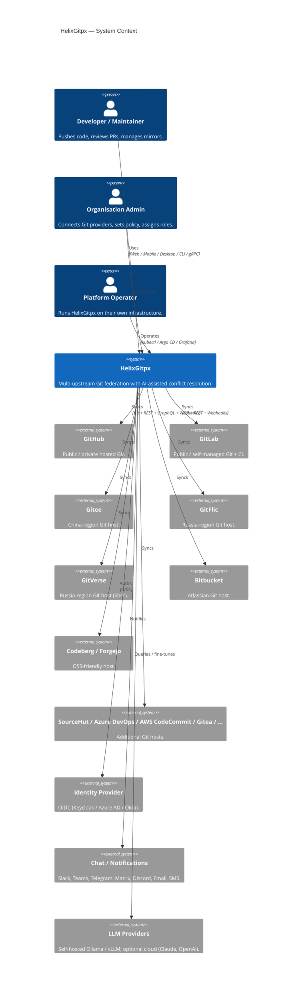
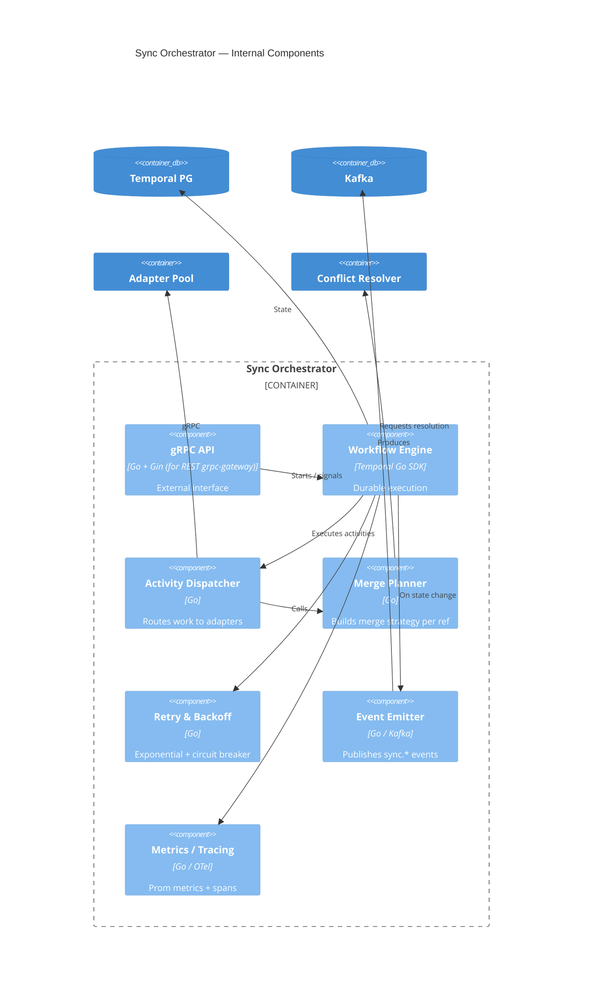
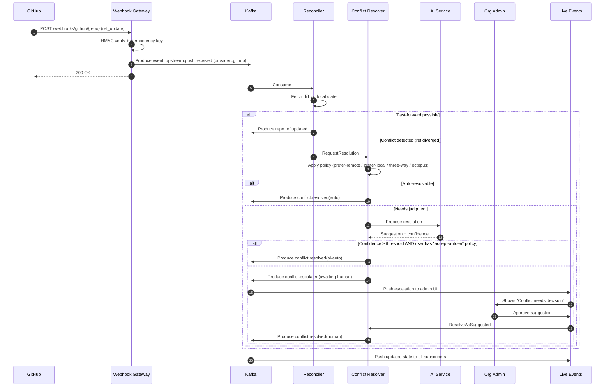
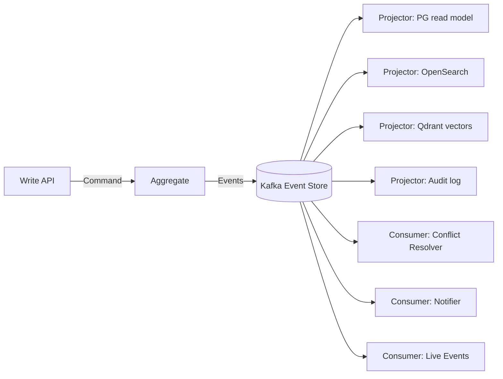

# 02 — System Architecture

> **Document purpose**: Define the **end-to-end architecture** of HelixGitpx across all services, data stores, messaging, client platforms, and cross-cutting concerns. Uses the **C4 model** (System Context → Container → Component → Code).

---

## 1. Architectural Style at a Glance

HelixGitpx is a **cloud-native, event-sourced, microservices** system with the following style pillars:

| Pillar | Choice | Why |
|---|---|---|
| **Service granularity** | Bounded-context microservices (~20) | Independent scaling, fault isolation, polyglot only where essential |
| **Inter-service sync call** | **gRPC** (HTTP/2, mTLS, protobuf) | Low latency, schema-enforced, streaming |
| **Inter-service async** | **Apache Kafka** | Backbone event log, replay, multi-consumer fan-out |
| **Read model updates** | **CQRS** — write model in Postgres, read models materialised into Postgres / OpenSearch / Meilisearch / Qdrant | Each read is optimised for its query pattern |
| **Event sourcing** | Applied to repository state (refs, metadata, reviews) | Full audit, time-travel, replay-ability |
| **Consistency** | Eventual across services; strong within a service | Bounded contexts own their truth |
| **Workflow engine** | **Temporal.io** (self-hosted) for long-running ops | Durable execution for multi-step sync workflows |
| **Service mesh** | **Istio** (Ambient mode) | mTLS, L7 policies, observability |
| **Workload identity** | **SPIFFE / SPIRE** | Short-lived certs, no long-lived secrets |
| **Config** | GitOps via **Argo CD** + Kustomize | Config is code |
| **Schema evolution** | Protobuf backward-compatible changes; Schema Registry (Karapace) for Kafka | Compile-time and runtime contracts |

---

## 2. C4 Level 1 — System Context



### Primary Flows

1. **Outbound sync (user pushes to HelixGitpx)**: Push → Ingress Service → Event bus → Sync Orchestrator → Per-upstream Worker → Upstream Git host.
2. **Inbound sync (upstream originates change)**: Upstream webhook → Webhook Gateway → Event bus → Reconciliation Worker → Internal state + fan-out to other upstreams.
3. **Live event to client**: Any state change → Event bus → Live-Events Service → gRPC stream / WebSocket → Client re-renders.
4. **Conflict resolution**: Conflict detected → Conflict Resolver → Policy check → If ambiguous, enqueue to LLM → Human signoff → Apply.

---

## 3. C4 Level 2 — Container Diagram

```mermaid
C4Container
    title HelixGitpx — Container View

    Person(user, "User")
    System_Ext(ups, "Git Upstreams\n(GitHub, GitLab, …)")
    System_Ext(idp, "OIDC IdP")
    System_Ext(chat, "Chat Channels")

    Container_Boundary(clients, "Client Layer") {
        Container(web, "Angular Web App", "TypeScript / Angular 19 / NgRx", "Primary user UI")
        Container(mobile, "Mobile (Android / iOS)", "Kotlin Multiplatform + Compose", "Mobile UI")
        Container(desktop, "Desktop (Win / macOS / Linux)", "Compose Multiplatform", "Desktop UI")
        Container(cli, "helixctl CLI", "Go", "Scripting + automation")
    }

    Container_Boundary(edge, "Edge") {
        Container(cdn, "Cloudflare / Fastly", "CDN + WAF", "TLS termination, DDoS mitigation")
        Container(ingress, "Istio Gateway", "Envoy", "L7 routing, mTLS egress")
        Container(apigw, "API Gateway", "Go / Gin + gRPC-Web", "AuthN/Z, rate limit, REST/gRPC multiplexing")
    }

    Container_Boundary(core, "Core Services (Go)") {
        Container(auth, "Auth Service", "Go / OIDC", "Tokens, sessions, SCIM")
        Container(org, "Org & Repo Service", "Go / Gin / gRPC", "Orgs, repos, teams, permissions")
        Container(upstream, "Upstream Registry", "Go", "Provider configs + credential vault")
        Container(adapter, "Provider Adapter Pool", "Go", "One goroutine pool per provider")
        Container(ingress_git, "Git Ingress", "Go / Gitaly bindings", "Receives git push/pull")
        Container(sync, "Sync Orchestrator", "Go + Temporal", "Bi-directional sync workflows")
        Container(conflict, "Conflict Resolver", "Go", "Merge engine, policy, CRDT")
        Container(webhook, "Webhook Gateway", "Go", "Inbound from upstreams")
        Container(notif, "Notifier", "Go", "Outbound multi-channel")
        Container(events, "Live-Events Service", "Go / gRPC streaming", "Push events to clients")
        Container(search, "Search Service", "Go", "Façade to OpenSearch / Meili / Qdrant")
        Container(ai, "AI Service", "Go + Python sidecars", "LLM routing + fine-tuning")
        Container(policy, "Policy Service", "Go / OPA", "Authorisation decisions")
        Container(audit, "Audit Service", "Go", "Append-only log ingestion")
        Container(billing, "Billing / Quotas", "Go", "Usage metering")
        Container(scheduler, "Scheduler", "Go", "Cron / delayed jobs")
    }

    ContainerDb(pg, "PostgreSQL 16", "Primary datastore (per-service DB)")
    ContainerDb(kafka, "Apache Kafka + Karapace", "Event backbone")
    ContainerDb(redis, "Redis / Dragonfly", "Cache, locks, rate-limit")
    ContainerDb(os, "OpenSearch", "Logs + full-text")
    ContainerDb(meili, "Meilisearch", "User-facing search")
    ContainerDb(qdrant, "Qdrant", "Vector search")
    ContainerDb(minio, "MinIO / S3 / R2", "LFS + artefact storage")
    ContainerDb(vault, "HashiCorp Vault / sealed-secrets", "Secrets")

    Rel(user, web, "Uses", "HTTPS")
    Rel(user, mobile, "Uses")
    Rel(user, desktop, "Uses")
    Rel(user, cli, "Runs")

    Rel(web, cdn, "HTTPS / WSS")
    Rel(mobile, cdn, "HTTPS / gRPC-Web")
    Rel(desktop, cdn, "HTTPS / gRPC")
    Rel(cli, cdn, "HTTPS / gRPC")

    Rel(cdn, ingress, "TLS passthrough / L7")
    Rel(ingress, apigw, "mTLS")
    Rel(apigw, auth, "gRPC")
    Rel(apigw, org, "gRPC")
    Rel(apigw, events, "gRPC stream / WebSocket")

    Rel(org, pg, "SQL")
    Rel(sync, kafka, "Produces/consumes")
    Rel(conflict, kafka, "Produces/consumes")
    Rel(webhook, kafka, "Produces")
    Rel(notif, kafka, "Consumes")
    Rel(events, kafka, "Consumes")

    Rel(adapter, ups, "Git + REST + webhooks")
    Rel(webhook, ups, "Receives webhooks")
    Rel(auth, idp, "OIDC")
    Rel(notif, chat, "Outbound notifications")
    Rel(ai, qdrant, "Vector")

    Rel(search, os, "Search API")
    Rel(search, meili, "Search API")
    Rel(search, qdrant, "Search API")

    UpdateElementStyle(helix, $bgColor="#9ACD32")
```



### 3.1 Container Responsibilities (summary)

| Container | Responsibility | Scaling Profile |
|---|---|---|
| **Angular Web** | User interface | CDN + edge caching |
| **Compose Multiplatform (mobile/desktop)** | Client apps | N/A |
| **helixctl CLI** | Scripting/automation | N/A |
| **API Gateway** | AuthN/Z, rate limit, routing | Horizontal, stateless |
| **Auth Service** | Identity, sessions, tokens | Horizontal |
| **Org & Repo Service** | Core domain — orgs, repos, teams | Sharded by org_id |
| **Upstream Registry** | Provider configs, credentials (via Vault) | Horizontal |
| **Provider Adapter Pool** | Actual talking to GitHub/GitLab/… | Horizontal per-provider |
| **Git Ingress** | git-over-HTTPS / SSH frontend | Horizontal |
| **Sync Orchestrator** | Temporal workflows for multi-step sync | Horizontal, Temporal handles state |
| **Conflict Resolver** | Merge/reconcile divergent upstream state | Horizontal, sharded by repo_id |
| **Webhook Gateway** | Inbound webhooks, HMAC verify | Horizontal |
| **Notifier** | Outbound chat/email/SMS | Horizontal |
| **Live-Events** | gRPC server streaming / WebSocket | Horizontal, sticky sessions |
| **Search Service** | Query façade | Horizontal |
| **AI Service** | LLM routing + fine-tune orchestration | GPU nodes, autoscaled |
| **Policy Service** | OPA decisions | Horizontal (idempotent) |
| **Audit Service** | Append-only sink | Horizontal writes, append-only |
| **Billing / Quotas** | Meter & enforce | Horizontal |
| **Scheduler** | Cron, backoff retry | Leader-elected (K8s lease) |

---

## 4. C4 Level 3 — Component View (example: Sync Orchestrator)



---

## 5. Bounded Contexts

| Context | Aggregates | Primary Events |
|---|---|---|
| **Identity & Access** | User, Session, Token, Role | `user.registered`, `session.expired`, `role.granted` |
| **Organisation** | Org, Team, Membership | `org.created`, `team.updated`, `member.added` |
| **Repository** | Repo, Ref, Tag, Release | `repo.created`, `ref.updated`, `tag.created` |
| **Upstream** | UpstreamConfig, Credential, Mirror | `upstream.connected`, `mirror.enabled`, `mirror.paused` |
| **Sync** | SyncJob, SyncRun, SyncStep | `sync.scheduled`, `sync.started`, `sync.completed`, `sync.failed` |
| **Conflict** | ConflictCase, Resolution | `conflict.detected`, `conflict.resolved`, `conflict.escalated` |
| **Collaboration** | PullRequest, Review, Issue, Comment | `pr.opened`, `review.submitted`, `issue.labeled` |
| **Policy** | Policy, Decision | `policy.evaluated`, `policy.changed` |
| **Audit** | AuditRecord | (append-only; all events land here too) |
| **AI** | PromptRun, FeedbackRecord, FineTuneJob | `ai.suggested`, `ai.accepted`, `ai.rejected`, `ai.finetuned` |
| **Notification** | NotificationChannel, NotificationEvent | `notify.sent`, `notify.failed` |
| **Billing** | Usage, Quota | `usage.recorded`, `quota.exceeded` |

Each context owns its data (one PG schema per service, one Kafka topic prefix per context).

---

## 6. Data Flow: "User Pushes to HelixGitpx"

```mermaid
sequenceDiagram
    autonumber
    participant C as Client (git)
    participant GI as Git Ingress
    participant R as Repo Service
    participant K as Kafka
    participant SO as Sync Orchestrator
    participant AP as Adapter Pool
    participant GH as GitHub
    participant GL as GitLab
    participant EV as Live Events
    participant W as Web UI

    C->>GI: git push (refs/heads/main)
    GI->>R: ValidateRef + ResolvePolicy (gRPC)
    R-->>GI: OK (policy allows; branch protection satisfied)
    GI->>GI: Persist pack objects (tmpfs, then to repo storage)
    GI->>K: Produce event: repo.push.received
    GI-->>C: 200 OK (ack)

    K->>SO: Consume repo.push.received
    SO->>SO: Start Temporal workflow: FanOutPush
    par Per upstream
        SO->>AP: Push to GitHub (gRPC activity)
        AP->>GH: git push --force-with-lease=… auth URL
        GH-->>AP: OK
        AP-->>SO: success
    and
        SO->>AP: Push to GitLab (gRPC activity)
        AP->>GL: git push …
        GL-->>AP: OK
        AP-->>SO: success
    end
    SO->>K: Produce event: sync.completed
    K->>EV: Consume sync.completed
    EV->>W: gRPC server-stream (UpdateEvent{repo=…, status=ok})
    W->>W: Update UI without reload
```

### Invariants Verified in This Flow

- **INV-1**: `repo.push.received` is persisted before the push is acknowledged.
- **INV-2**: Fan-out is done via Temporal workflow → exactly-once activity execution semantics.
- **INV-3**: On any upstream failure, the workflow retries with policy-driven backoff; never silently drops.
- **INV-4**: The UI receives the event only after Sync Orchestrator confirms each upstream — no speculative UI.

---

## 7. Data Flow: "Inbound Push from Upstream (Conflict)"



---

## 8. Event-Sourced Core

The **Repository aggregate** is event-sourced. Writes emit events; state is derived. This gives:

- Full audit trail.
- Point-in-time reconstruction ("what did repo X look like at 2026-04-01 09:00?").
- Safe cross-upstream reconciliation (events are the source of truth; each upstream's view is a projection).
- Painless schema migration (replay events into new schema).

**Event store**: Kafka (primary; long retention on compacted topics for state, log retention on stream topics for audit). Snapshots to Postgres for fast read.



---

## 9. Cross-Cutting Concerns

### 9.1 AuthN & AuthZ

- **AuthN**: OIDC (any IdP: Keycloak, Dex, Authentik, Azure AD, Okta, Google). Access tokens short-lived (15 min), refresh via rotating token.
- **Service-to-service**: SPIFFE/SPIRE-issued X.509 SVIDs (mTLS), rotated every 1 h.
- **AuthZ**: OPA (Rego) policies evaluated at the API Gateway and within each service for fine-grained checks. Policies version-controlled and GitOps-deployed.
- **RBAC model**: Role → Permission bundle; attached at (org, team, repo, ref) scope. Permissions are enumerated in [11-security-compliance.md](../08-security/11-security-compliance.md).

### 9.2 Observability

- **Traces**: OpenTelemetry SDK in every service → OTel Collector → Tempo (storage) + Jaeger UI.
- **Metrics**: Prometheus scraping + Grafana dashboards. Canonical prefix `helixgitpx_*` (see [18-observability.md](../09-observability/18-observability.md)).
- **Logs**: Structured JSON → Vector → Loki (short term) + OpenSearch (long term, search).
- **Profiles**: Continuous profiling via Pyroscope.
- **Real-user metrics**: Sentry (self-hosted) + OTel RUM on web.
- **Synthetic**: k6 synthetic probes every 30 s from 3 regions.

### 9.3 Resilience Patterns

| Pattern | Where |
|---|---|
| Circuit breaker | Every outbound adapter call (gobreaker) |
| Bulkhead | Goroutine pools with fixed concurrency per provider |
| Timeout | All network calls — no unbounded waits |
| Retry with jitter | Temporal activities; Kafka consumer DLQ |
| Idempotency keys | All write APIs |
| Outbox pattern | Postgres writes publish to Kafka via `pg-to-kafka` outbox sidecar (Debezium CDC) |
| Saga | Long-running multi-service flows (org onboarding, repo migration) via Temporal |
| Backpressure | Kafka lag-based autoscaling; gRPC flow control |
| Chaos | Daily Litmus fault injection in staging |

### 9.4 Multi-Tenancy

- Logical isolation: `org_id` included in every row, every event, every trace.
- Postgres Row-Level Security (RLS): every read enforces `org_id = current_setting('app.org_id')`.
- Kafka: per-tenant topic prefix for high-volume events; shared topic with tenant key otherwise.
- Hard isolation (opt-in, enterprise tier): per-tenant dedicated namespaces + node pool.

### 9.5 Rate Limiting

- **Inbound (client → API)**: Per-user, per-token, per-IP, per-org — implemented with Redis + leaky-bucket.
- **Outbound (adapter → upstream)**: Provider-specific; respects `X-RateLimit-*` headers and backs off globally.
- **Webhook ingestion**: Per-source HMAC key rate limit (detect storm / replay).

### 9.6 Secrets Management

- HashiCorp Vault (or Sealed Secrets + SOPS on smaller footprints).
- Adapter credentials: encrypted at rest + rotated.
- Short-lived DB creds via Vault DB engine.
- SSH host keys for `git` protocol: rotated; authorized_keys derived dynamically.

---

## 10. Deployment Topology

### 10.1 Reference Topology (Single-Region GA)

- 3 × control-plane nodes (K8s masters; HA etcd).
- 6 × application nodes (Go services, autoscaled).
- 3 × data nodes (Postgres — 1 primary + 2 replicas via Patroni).
- 3 × Kafka brokers (Strimzi operator).
- 3 × Redis nodes (Sentinel HA) or 1 × Dragonfly (vertical-first).
- 2 × OpenSearch nodes (hot) + 1 × warm/cold tier.
- 2 × GPU nodes (autoscaled 0→N) for LLM inference/training.
- 1 × Temporal cluster (2-node HA).
- Observability stack (Prometheus/Grafana/Tempo/Loki) on infrastructure nodes.
- Backup: Postgres WAL archive to S3/R2 + Velero for K8s volumes.

### 10.2 Multi-Region

- 2-region active-active via:
  - Postgres: logical replication + pg_easy_ha failover (per-service, to minimise cross-region write latency).
  - Kafka: **MirrorMaker 2** for selective topic replication.
  - OpenSearch: cross-cluster replication.
  - Argo CD ApplicationSet per region.
  - Traffic routing: Cloudflare Load Balancer with health-checked pools.

### 10.3 Dev / Staging / Prod

| Env | Purpose | Topology |
|---|---|---|
| **local** | Dev laptop | docker-compose (everything) |
| **ci** | CI pipelines | Ephemeral K3d cluster per PR |
| **staging** | Pre-prod QA | Scaled-down prod replica in same cloud, smaller node pools |
| **canary** | Pre-prod with real traffic (<5%) | Same cluster as prod, separate namespace, canary Istio routes |
| **prod** | Production | Full HA topology |
| **chaos** | Dedicated chaos experiments | Staging-mirror; destructive testing |

---

## 11. Technology Mapping to Constraints

Each constraint from [01-vision-scope-constraints.md](../00-core/01-vision-scope-constraints.md) §4 maps here:

| Mandate | Implementation |
|---|---|
| M-1 Tech constraints | §1 pillars + §9 cross-cutting |
| M-2 100 % coverage | CI gate + mutation testing (see §15) |
| M-3 Schema-driven | protoc-based codegen (see §04-apis) |
| M-4 Sync safety | Event sourcing + outbox + Temporal |
| M-5 Live reactivity | Live-Events service + client resume tokens |
| M-6 Zero-trust | SPIFFE/SPIRE + Cosign + SLSA |
| M-7 Scaling | §10.2 multi-region + HPA/VPA + Karpenter |
| M-8 Docs | This suite + doc-as-code pipeline |
| M-9 A11y / i18n | Angular CDK + ICU + Weblate |
| M-10 Privacy | Data-residency enforced; opt-in telemetry |

---

## 12. Architecture Decision Records (ADRs)

Complete ADRs live in [01-architecture/adr/](adr/). Summary of the major ones:

| ADR | Decision | Status |
|---|---|---|
| ADR-0001 | Microservices over modular monolith | Accepted |
| ADR-0002 | Kafka over NATS JetStream as primary bus | Accepted |
| ADR-0003 | OpenSearch over Elasticsearch | Accepted (license) |
| ADR-0004 | Meilisearch for user-facing search | Accepted |
| ADR-0005 | Qdrant for vector DB | Accepted |
| ADR-0006 | Kotlin Multiplatform + Compose for mobile + desktop | Accepted |
| ADR-0007 | Temporal for durable workflows | Accepted |
| ADR-0008 | Event sourcing for Repo aggregate | Accepted |
| ADR-0009 | CQRS with per-read-model projectors | Accepted |
| ADR-0010 | SPIFFE/SPIRE for workload identity | Accepted |
| ADR-0011 | Istio Ambient over sidecars | Accepted |
| ADR-0012 | OPA for AuthZ | Accepted |
| ADR-0013 | Self-hosted Ollama + vLLM for LLM default | Accepted |
| ADR-0014 | Argo CD (GitOps) over helm-cli push | Accepted |
| ADR-0015 | WebAssembly for custom adapter plugins | Accepted |
| ADR-0016 | Gin Gonic for REST (mandated by constraints) | Accepted |
| ADR-0017 | Debezium CDC outbox pattern | Accepted |
| ADR-0018 | Karapace as Schema Registry | Accepted |

---

## 13. Key Innovations Over v4.0.0 Spec

This architecture **extends** the v4.0.0 spec in the following novel ways:

1. **Event-sourced repository aggregate** — previously implicit; now explicit with Kafka as event store.
2. **Temporal for durable workflows** — replaces bespoke retry logic.
3. **SPIFFE/SPIRE zero-trust** — every service-to-service call has a workload-scoped cert.
4. **CRDT metadata sync** — for issues/labels/milestones, we use Automerge-style CRDTs so concurrent edits on two upstreams merge without losing data.
5. **Self-learning LLM loop** — RLAIF pipeline fine-tunes the conflict resolver on user feedback (see §10).
6. **Shadow-mode new adapters** — new provider integration runs read-only on real traffic for a configurable soak period before activation.
7. **Policy-as-code with OPA + Kyverno** — authZ + admission.
8. **Deterministic reproducible builds** — SLSA L3 provenance attested into Rekor.
9. **End-to-end OpenTelemetry** — trace spans from browser click → gRPC → Kafka → worker → upstream.
10. **Feature flags (Unleash/OpenFeature)** — every new capability ships behind a flag.

---

*— End of System Architecture —*
