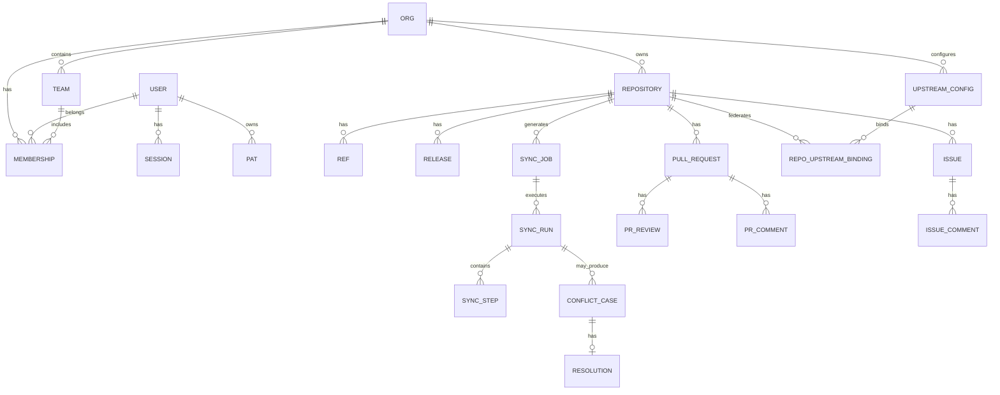

# 04 — Data Model (PostgreSQL)

> **Document purpose**: Define the **complete PostgreSQL schema** for HelixGitpx, across every service. Includes tables, indexes, constraints, partitioning, RLS policies, migrations strategy, and entity-relationship diagrams.

---

## 1. Design Principles

1. **One schema per service** — services never share tables. Cross-service reads go through gRPC or are denormalised into read models.
2. **UUIDv7 primary keys** — time-ordered UUIDs for index locality and natural ordering.
3. **Row-Level Security (RLS)** — every multi-tenant table enforces `org_id = current_setting('app.org_id')`.
4. **Append-only where possible** — event logs and audits are never updated/deleted.
5. **Partition by time** — event logs, audit, metrics partitioned monthly; dropped after retention.
6. **Explicit FKs** — nothing is "by convention". Referential integrity is enforced.
7. **Soft-delete only where it serves the domain** — usually a `deleted_at` column; mostly we prefer explicit archive status.
8. **All timestamps `TIMESTAMPTZ`** — UTC stored; clients convert.
9. **All text columns `TEXT`** — no `VARCHAR(n)`. Length limits enforced at application layer.
10. **Check constraints over magic numbers** — enums enforced at DB level.
11. **Logical deletes with `deleted_at`** — never `DROP` rows except via partition drop.

---

## 2. Shared Conventions

### 2.1 Column Conventions

| Column | Type | Notes |
|---|---|---|
| `id` | `UUID` | Primary key; UUIDv7 generated client-side (Go `google/uuid` v5+) |
| `org_id` | `UUID` | Tenant key (where applicable) |
| `created_at` | `TIMESTAMPTZ NOT NULL DEFAULT now()` | |
| `updated_at` | `TIMESTAMPTZ NOT NULL DEFAULT now()` | Touched by trigger |
| `deleted_at` | `TIMESTAMPTZ` NULL | Soft delete (where used) |
| `version` | `BIGINT NOT NULL DEFAULT 0` | Optimistic concurrency |
| `created_by` | `UUID` | User id |

### 2.2 Common Triggers

```sql
CREATE OR REPLACE FUNCTION touch_updated_at()
RETURNS TRIGGER LANGUAGE plpgsql AS $$
BEGIN
    NEW.updated_at = now();
    NEW.version = OLD.version + 1;
    RETURN NEW;
END;
$$;
```

Applied to every `UPDATE`able table.

### 2.3 Extensions

Required on every database:

```sql
CREATE EXTENSION IF NOT EXISTS "pgcrypto";
CREATE EXTENSION IF NOT EXISTS "pg_trgm";            -- trigram search
CREATE EXTENSION IF NOT EXISTS "btree_gin";
CREATE EXTENSION IF NOT EXISTS "citext";              -- case-insensitive text
CREATE EXTENSION IF NOT EXISTS "uuid-ossp";
CREATE EXTENSION IF NOT EXISTS "timescaledb";        -- time-series (metrics)
CREATE EXTENSION IF NOT EXISTS "pg_stat_statements";
CREATE EXTENSION IF NOT EXISTS "pgaudit";
```

### 2.4 RLS Template

```sql
ALTER TABLE {schema}.{table} ENABLE ROW LEVEL SECURITY;

CREATE POLICY tenant_isolation ON {schema}.{table}
  USING (org_id = current_setting('app.org_id', true)::uuid)
  WITH CHECK (org_id = current_setting('app.org_id', true)::uuid);

CREATE POLICY tenant_isolation_service ON {schema}.{table}
  USING (current_setting('app.role', true) = 'service')
  WITH CHECK (current_setting('app.role', true) = 'service');
```

Session GUCs set in `SET LOCAL` at the start of every transaction, carrying the tenant and role.

---

## 3. Entity-Relationship Overview



---

## 4. Schema-by-Schema

### 4.1 `auth` schema (owned by auth-service)

```sql
CREATE SCHEMA auth;
SET search_path = auth, public;

-- Users
CREATE TABLE users (
    id             UUID PRIMARY KEY,
    email          CITEXT NOT NULL UNIQUE,
    username       CITEXT NOT NULL UNIQUE,
    display_name   TEXT NOT NULL,
    avatar_url     TEXT,
    primary_locale TEXT NOT NULL DEFAULT 'en',
    timezone       TEXT NOT NULL DEFAULT 'UTC',
    external_id    TEXT,                          -- IdP subject
    external_issuer TEXT,                          -- IdP URL
    mfa_required  BOOLEAN NOT NULL DEFAULT false,
    status         TEXT NOT NULL DEFAULT 'active' CHECK (status IN ('active','suspended','deleted')),
    created_at     TIMESTAMPTZ NOT NULL DEFAULT now(),
    updated_at     TIMESTAMPTZ NOT NULL DEFAULT now(),
    deleted_at     TIMESTAMPTZ,
    version        BIGINT NOT NULL DEFAULT 0,
    UNIQUE (external_issuer, external_id)
);
CREATE INDEX users_email_idx ON users (email);
CREATE INDEX users_username_trgm_idx ON users USING gin (username gin_trgm_ops);
CREATE TRIGGER users_touch BEFORE UPDATE ON users
    FOR EACH ROW EXECUTE FUNCTION public.touch_updated_at();

-- Sessions
CREATE TABLE sessions (
    id             UUID PRIMARY KEY,
    user_id        UUID NOT NULL REFERENCES users(id) ON DELETE CASCADE,
    ip             INET NOT NULL,
    user_agent     TEXT,
    device_fingerprint TEXT,
    issued_at      TIMESTAMPTZ NOT NULL DEFAULT now(),
    last_seen_at   TIMESTAMPTZ NOT NULL DEFAULT now(),
    expires_at     TIMESTAMPTZ NOT NULL,
    revoked_at     TIMESTAMPTZ,
    revoke_reason  TEXT
);
CREATE INDEX sessions_user_idx ON sessions (user_id) WHERE revoked_at IS NULL;
CREATE INDEX sessions_expiry_idx ON sessions (expires_at);

-- Refresh tokens (with reuse detection)
CREATE TABLE tokens_refresh (
    id             UUID PRIMARY KEY,
    session_id     UUID NOT NULL REFERENCES sessions(id) ON DELETE CASCADE,
    token_hash     TEXT NOT NULL,             -- Argon2id
    family_id      UUID NOT NULL,             -- same family = related refreshes
    parent_id      UUID REFERENCES tokens_refresh(id),
    issued_at      TIMESTAMPTZ NOT NULL DEFAULT now(),
    expires_at     TIMESTAMPTZ NOT NULL,
    used_at        TIMESTAMPTZ,
    UNIQUE (token_hash)
);
CREATE INDEX tokens_refresh_family_idx ON tokens_refresh (family_id);

-- Personal Access Tokens
CREATE TABLE tokens_pat (
    id             UUID PRIMARY KEY,
    user_id        UUID NOT NULL REFERENCES users(id) ON DELETE CASCADE,
    name           TEXT NOT NULL,
    token_hash     TEXT NOT NULL UNIQUE,
    scopes         TEXT[] NOT NULL,           -- e.g. {repo:read, org:admin}
    last_used_at   TIMESTAMPTZ,
    expires_at     TIMESTAMPTZ,
    created_at     TIMESTAMPTZ NOT NULL DEFAULT now(),
    revoked_at     TIMESTAMPTZ
);
CREATE INDEX tokens_pat_user_idx ON tokens_pat (user_id) WHERE revoked_at IS NULL;

-- MFA factors
CREATE TABLE mfa_factors (
    id             UUID PRIMARY KEY,
    user_id        UUID NOT NULL REFERENCES users(id) ON DELETE CASCADE,
    type           TEXT NOT NULL CHECK (type IN ('totp','webauthn','backup_codes')),
    label          TEXT,
    secret         BYTEA NOT NULL,            -- encrypted at rest
    counter        BIGINT,
    credential_id  BYTEA,                     -- WebAuthn
    public_key     BYTEA,                     -- WebAuthn
    last_used_at   TIMESTAMPTZ,
    created_at     TIMESTAMPTZ NOT NULL DEFAULT now()
);
CREATE INDEX mfa_factors_user_idx ON mfa_factors (user_id);

-- Login audit (partitioned monthly)
CREATE TABLE login_audit (
    id             UUID NOT NULL,
    user_id        UUID,                       -- null on failed unknown-user attempts
    email          CITEXT,
    ip             INET NOT NULL,
    user_agent     TEXT,
    country        TEXT,
    city           TEXT,
    status         TEXT NOT NULL CHECK (status IN ('success','fail','mfa_required','mfa_fail','locked')),
    reason         TEXT,
    occurred_at    TIMESTAMPTZ NOT NULL DEFAULT now(),
    PRIMARY KEY (occurred_at, id)
) PARTITION BY RANGE (occurred_at);

-- Example partitions created by pg_partman:
CREATE TABLE login_audit_2026_04 PARTITION OF login_audit
    FOR VALUES FROM ('2026-04-01') TO ('2026-05-01');
```

---

### 4.2 `org` schema (owned by org-service)

```sql
CREATE SCHEMA org;
SET search_path = org, public;

CREATE TABLE organisations (
    id             UUID PRIMARY KEY,
    slug           CITEXT NOT NULL UNIQUE,
    display_name   TEXT NOT NULL,
    description    TEXT,
    avatar_url     TEXT,
    website        TEXT,
    default_visibility TEXT NOT NULL DEFAULT 'private' CHECK (default_visibility IN ('public','private','internal')),
    billing_plan   TEXT NOT NULL DEFAULT 'free',
    region         TEXT NOT NULL DEFAULT 'eu-west',
    settings       JSONB NOT NULL DEFAULT '{}',
    created_at     TIMESTAMPTZ NOT NULL DEFAULT now(),
    updated_at     TIMESTAMPTZ NOT NULL DEFAULT now(),
    deleted_at     TIMESTAMPTZ,
    version        BIGINT NOT NULL DEFAULT 0
);

CREATE TABLE teams (
    id             UUID PRIMARY KEY,
    org_id         UUID NOT NULL REFERENCES organisations(id) ON DELETE CASCADE,
    slug           CITEXT NOT NULL,
    display_name   TEXT NOT NULL,
    description    TEXT,
    parent_team_id UUID REFERENCES teams(id),
    created_at     TIMESTAMPTZ NOT NULL DEFAULT now(),
    updated_at     TIMESTAMPTZ NOT NULL DEFAULT now(),
    version        BIGINT NOT NULL DEFAULT 0,
    UNIQUE (org_id, slug)
);
CREATE INDEX teams_parent_idx ON teams (parent_team_id);

CREATE TABLE memberships (
    id             UUID PRIMARY KEY,
    org_id         UUID NOT NULL REFERENCES organisations(id) ON DELETE CASCADE,
    user_id        UUID NOT NULL,
    team_id        UUID REFERENCES teams(id) ON DELETE CASCADE,  -- null = org-level membership
    role           TEXT NOT NULL CHECK (role IN ('owner','admin','maintainer','developer','viewer')),
    invited_by     UUID,
    invited_at     TIMESTAMPTZ,
    joined_at      TIMESTAMPTZ,
    expires_at     TIMESTAMPTZ,
    created_at     TIMESTAMPTZ NOT NULL DEFAULT now(),
    updated_at     TIMESTAMPTZ NOT NULL DEFAULT now(),
    UNIQUE (org_id, user_id, team_id)
);
CREATE INDEX memberships_user_idx ON memberships (user_id);

ALTER TABLE organisations ENABLE ROW LEVEL SECURITY;
ALTER TABLE teams ENABLE ROW LEVEL SECURITY;
ALTER TABLE memberships ENABLE ROW LEVEL SECURITY;
-- Policies as per template
```

---

### 4.3 `repo` schema (owned by repo-service — event-sourced core)

```sql
CREATE SCHEMA repo;
SET search_path = repo, public;

-- Repositories (aggregate root snapshot)
CREATE TABLE repositories (
    id             UUID PRIMARY KEY,
    org_id         UUID NOT NULL,
    slug           CITEXT NOT NULL,
    display_name   TEXT NOT NULL,
    description    TEXT,
    visibility     TEXT NOT NULL CHECK (visibility IN ('public','private','internal')),
    default_branch TEXT NOT NULL DEFAULT 'main',
    primary_upstream TEXT,                              -- which upstream is the "source of truth" if any
    size_bytes     BIGINT NOT NULL DEFAULT 0,
    archived       BOOLEAN NOT NULL DEFAULT false,
    template       BOOLEAN NOT NULL DEFAULT false,
    created_at     TIMESTAMPTZ NOT NULL DEFAULT now(),
    updated_at     TIMESTAMPTZ NOT NULL DEFAULT now(),
    deleted_at     TIMESTAMPTZ,
    version        BIGINT NOT NULL DEFAULT 0,
    UNIQUE (org_id, slug)
);

-- Event log (source of truth for repo state)
CREATE TABLE repo_events (
    id             UUID PRIMARY KEY,
    repo_id        UUID NOT NULL REFERENCES repositories(id) ON DELETE CASCADE,
    sequence       BIGINT NOT NULL,                    -- per-repo monotonic
    event_type     TEXT NOT NULL,                      -- 'repo.created', 'ref.updated', …
    event_version  INT NOT NULL DEFAULT 1,
    payload        JSONB NOT NULL,
    actor_id       UUID,
    origin         TEXT NOT NULL CHECK (origin IN ('local','upstream','system','ai')),
    origin_detail  TEXT,                               -- e.g. 'github' when origin='upstream'
    causation_id   UUID,                               -- event that caused this
    correlation_id UUID,                               -- trace id
    occurred_at    TIMESTAMPTZ NOT NULL DEFAULT now(),
    UNIQUE (repo_id, sequence)
) PARTITION BY HASH (repo_id);
-- 16 hash partitions created at setup
CREATE INDEX repo_events_repo_occurred_idx ON repo_events (repo_id, occurred_at DESC);
CREATE INDEX repo_events_type_idx ON repo_events (event_type);

-- Refs (snapshot / read model)
CREATE TABLE refs (
    repo_id        UUID NOT NULL REFERENCES repositories(id) ON DELETE CASCADE,
    name           TEXT NOT NULL,                     -- 'refs/heads/main', 'refs/tags/v1.0'
    kind           TEXT NOT NULL CHECK (kind IN ('branch','tag','other')),
    target_sha     TEXT NOT NULL,
    is_protected   BOOLEAN NOT NULL DEFAULT false,
    last_updated_at TIMESTAMPTZ NOT NULL DEFAULT now(),
    last_updated_by UUID,
    last_origin    TEXT NOT NULL,
    version        BIGINT NOT NULL DEFAULT 0,
    PRIMARY KEY (repo_id, name)
);
CREATE INDEX refs_updated_idx ON refs (last_updated_at DESC);

-- Tags (denormalised view of refs/tags/*)
CREATE TABLE tags (
    repo_id        UUID NOT NULL REFERENCES repositories(id) ON DELETE CASCADE,
    name           TEXT NOT NULL,
    target_sha     TEXT NOT NULL,
    target_type    TEXT NOT NULL CHECK (target_type IN ('commit','tag')),
    message        TEXT,
    signature      TEXT,
    created_at     TIMESTAMPTZ NOT NULL DEFAULT now(),
    PRIMARY KEY (repo_id, name)
);

-- Releases
CREATE TABLE releases (
    id             UUID PRIMARY KEY,
    repo_id        UUID NOT NULL REFERENCES repositories(id) ON DELETE CASCADE,
    tag_name       TEXT NOT NULL,
    name           TEXT,
    body           TEXT,
    draft          BOOLEAN NOT NULL DEFAULT false,
    prerelease     BOOLEAN NOT NULL DEFAULT false,
    published_at   TIMESTAMPTZ,
    created_by     UUID,
    created_at     TIMESTAMPTZ NOT NULL DEFAULT now(),
    updated_at     TIMESTAMPTZ NOT NULL DEFAULT now(),
    UNIQUE (repo_id, tag_name)
);

CREATE TABLE release_assets (
    id             UUID PRIMARY KEY,
    release_id     UUID NOT NULL REFERENCES releases(id) ON DELETE CASCADE,
    name           TEXT NOT NULL,
    size_bytes     BIGINT NOT NULL,
    content_type   TEXT,
    sha256         TEXT NOT NULL,
    storage_uri    TEXT NOT NULL,                     -- s3://… or r2://…
    download_count BIGINT NOT NULL DEFAULT 0,
    created_at     TIMESTAMPTZ NOT NULL DEFAULT now()
);

-- Branch protection
CREATE TABLE branch_protection_rules (
    id             UUID PRIMARY KEY,
    repo_id        UUID NOT NULL REFERENCES repositories(id) ON DELETE CASCADE,
    pattern        TEXT NOT NULL,                     -- glob; 'main', 'release/*'
    require_signed_commits BOOLEAN NOT NULL DEFAULT false,
    require_linear_history BOOLEAN NOT NULL DEFAULT false,
    allow_force_push BOOLEAN NOT NULL DEFAULT false,
    force_push_strategy TEXT CHECK (force_push_strategy IN ('with_lease','never')),
    required_approving_reviews INT NOT NULL DEFAULT 0,
    required_status_checks TEXT[] NOT NULL DEFAULT '{}',
    restricted_pushers_team_ids UUID[] DEFAULT '{}',
    created_at     TIMESTAMPTZ NOT NULL DEFAULT now(),
    updated_at     TIMESTAMPTZ NOT NULL DEFAULT now(),
    UNIQUE (repo_id, pattern)
);

-- Upstream bindings (which upstreams this repo federates to)
CREATE TABLE repo_upstream_bindings (
    id             UUID PRIMARY KEY,
    repo_id        UUID NOT NULL REFERENCES repositories(id) ON DELETE CASCADE,
    upstream_id    UUID NOT NULL,                     -- references upstream.upstreams(id)
    enabled        BOOLEAN NOT NULL DEFAULT true,
    direction      TEXT NOT NULL DEFAULT 'bidirectional' CHECK (direction IN ('push_only','pull_only','bidirectional')),
    remote_owner   TEXT NOT NULL,
    remote_name    TEXT NOT NULL,
    last_sync_at   TIMESTAMPTZ,
    last_sync_status TEXT,
    shadow_mode    BOOLEAN NOT NULL DEFAULT false,
    created_at     TIMESTAMPTZ NOT NULL DEFAULT now(),
    updated_at     TIMESTAMPTZ NOT NULL DEFAULT now(),
    UNIQUE (repo_id, upstream_id)
);
CREATE INDEX repo_bindings_repo_idx ON repo_upstream_bindings (repo_id);
CREATE INDEX repo_bindings_upstream_idx ON repo_upstream_bindings (upstream_id);

ALTER TABLE repositories ENABLE ROW LEVEL SECURITY;
ALTER TABLE refs ENABLE ROW LEVEL SECURITY;
ALTER TABLE repo_events ENABLE ROW LEVEL SECURITY;
-- etc. (via generator in migrations)
```

---

### 4.4 `upstream` schema (owned by upstream-registry)

```sql
CREATE SCHEMA upstream;
SET search_path = upstream, public;

CREATE TABLE providers (
    id             UUID PRIMARY KEY,
    kind           TEXT NOT NULL CHECK (kind IN ('github','gitlab','gitee','gitflic','gitverse','bitbucket','codeberg','gitea','forgejo','sourcehut','azure','aws_codecommit','generic','wasm_plugin')),
    display_name   TEXT NOT NULL,
    default_base_url TEXT NOT NULL,
    capabilities   JSONB NOT NULL DEFAULT '{}',       -- {lfs:true, graphql:true, webhooks:true, ...}
    adapter_version TEXT NOT NULL,                     -- e.g. 'v1.3.0'
    wasm_plugin_uri TEXT,                              -- if kind=wasm_plugin
    created_at     TIMESTAMPTZ NOT NULL DEFAULT now(),
    updated_at     TIMESTAMPTZ NOT NULL DEFAULT now()
);

CREATE TABLE upstreams (
    id             UUID PRIMARY KEY,
    org_id         UUID NOT NULL,
    provider_id    UUID NOT NULL REFERENCES providers(id),
    display_name   TEXT NOT NULL,
    base_url       TEXT NOT NULL,
    auth_method    TEXT NOT NULL CHECK (auth_method IN ('oauth2','pat','app_token','ssh_key','deploy_key')),
    vault_path     TEXT NOT NULL,                     -- Vault KV ref
    health_status  TEXT NOT NULL DEFAULT 'unknown' CHECK (health_status IN ('healthy','degraded','unhealthy','unknown')),
    health_last_checked_at TIMESTAMPTZ,
    rate_limit_quota INT,                              -- per hour; provider-reported
    rate_limit_remaining INT,
    rate_limit_resets_at TIMESTAMPTZ,
    shadow_mode    BOOLEAN NOT NULL DEFAULT false,
    enabled        BOOLEAN NOT NULL DEFAULT true,
    created_at     TIMESTAMPTZ NOT NULL DEFAULT now(),
    updated_at     TIMESTAMPTZ NOT NULL DEFAULT now(),
    deleted_at     TIMESTAMPTZ,
    version        BIGINT NOT NULL DEFAULT 0,
    UNIQUE (org_id, provider_id, base_url)
);
CREATE INDEX upstreams_health_idx ON upstreams (health_status) WHERE enabled = true;

CREATE TABLE credential_rotations (
    id             UUID PRIMARY KEY,
    upstream_id    UUID NOT NULL REFERENCES upstreams(id) ON DELETE CASCADE,
    rotated_at     TIMESTAMPTZ NOT NULL DEFAULT now(),
    rotated_by     UUID,
    reason         TEXT
);

ALTER TABLE upstreams ENABLE ROW LEVEL SECURITY;
```

---

### 4.5 `sync` schema (owned by sync-orchestrator)

```sql
CREATE SCHEMA sync;
SET search_path = sync, public;

CREATE TABLE sync_jobs (
    id             UUID PRIMARY KEY,
    org_id         UUID NOT NULL,
    repo_id        UUID NOT NULL,
    trigger        TEXT NOT NULL CHECK (trigger IN ('local_push','upstream_webhook','manual','scheduled','reconciliation')),
    workflow_id    TEXT NOT NULL,                      -- Temporal
    run_id         TEXT NOT NULL,                      -- Temporal
    status         TEXT NOT NULL DEFAULT 'scheduled' CHECK (status IN ('scheduled','running','completed','failed','cancelled')),
    scheduled_at   TIMESTAMPTZ NOT NULL DEFAULT now(),
    started_at     TIMESTAMPTZ,
    completed_at   TIMESTAMPTZ,
    error          TEXT,
    created_at     TIMESTAMPTZ NOT NULL DEFAULT now(),
    updated_at     TIMESTAMPTZ NOT NULL DEFAULT now()
);
CREATE INDEX sync_jobs_repo_idx ON sync_jobs (repo_id, scheduled_at DESC);
CREATE INDEX sync_jobs_status_idx ON sync_jobs (status, scheduled_at) WHERE status IN ('scheduled','running');

CREATE TABLE sync_runs (
    id             UUID PRIMARY KEY,
    job_id         UUID NOT NULL REFERENCES sync_jobs(id) ON DELETE CASCADE,
    attempt        INT NOT NULL,
    started_at     TIMESTAMPTZ NOT NULL DEFAULT now(),
    finished_at    TIMESTAMPTZ,
    status         TEXT NOT NULL CHECK (status IN ('running','success','partial','failed')),
    UNIQUE (job_id, attempt)
);

CREATE TABLE sync_steps (
    id             UUID PRIMARY KEY,
    run_id         UUID NOT NULL REFERENCES sync_runs(id) ON DELETE CASCADE,
    upstream_id    UUID NOT NULL,
    operation      TEXT NOT NULL,                    -- 'push_refs', 'pull_refs', 'sync_metadata'
    status         TEXT NOT NULL CHECK (status IN ('pending','running','success','failed','skipped','retried')),
    started_at     TIMESTAMPTZ,
    finished_at    TIMESTAMPTZ,
    error_code     TEXT,
    error_message  TEXT,
    bytes_in       BIGINT,
    bytes_out      BIGINT,
    refs_updated   INT,
    refs_deleted   INT
);
CREATE INDEX sync_steps_run_idx ON sync_steps (run_id);
CREATE INDEX sync_steps_upstream_idx ON sync_steps (upstream_id, status);

ALTER TABLE sync_jobs ENABLE ROW LEVEL SECURITY;
```

---

### 4.6 `conflict` schema (owned by conflict-resolver)

```sql
CREATE SCHEMA conflict;
SET search_path = conflict, public;

CREATE TABLE conflict_cases (
    id             UUID PRIMARY KEY,
    org_id         UUID NOT NULL,
    repo_id        UUID NOT NULL,
    detected_at    TIMESTAMPTZ NOT NULL DEFAULT now(),
    kind           TEXT NOT NULL CHECK (kind IN ('ref_divergence','metadata_concurrent_edit','rename_collision','pr_state_divergence','tag_collision','lfs_object_divergence','other')),
    subject        TEXT NOT NULL,                     -- e.g. 'refs/heads/main', 'issue #42'
    left_side      JSONB NOT NULL,                    -- our side
    right_side     JSONB NOT NULL,                    -- upstream side
    common_ancestor JSONB,                             -- if applicable (three-way)
    upstream_id    UUID,
    status         TEXT NOT NULL DEFAULT 'open' CHECK (status IN ('open','resolving','resolved','escalated','abandoned')),
    resolution_strategy TEXT,
    created_at     TIMESTAMPTZ NOT NULL DEFAULT now(),
    updated_at     TIMESTAMPTZ NOT NULL DEFAULT now()
);
CREATE INDEX conflicts_repo_status_idx ON conflict_cases (repo_id, status);
CREATE INDEX conflicts_detected_idx ON conflict_cases (detected_at DESC);

CREATE TABLE resolutions (
    id             UUID PRIMARY KEY,
    case_id        UUID NOT NULL REFERENCES conflict_cases(id) ON DELETE CASCADE,
    decided_by     TEXT NOT NULL CHECK (decided_by IN ('policy','crdt','ai','human','ai_human_signoff')),
    decided_by_user_id UUID,
    ai_model       TEXT,
    ai_confidence  NUMERIC(5,4),                      -- 0..1
    payload        JSONB NOT NULL,                    -- the applied result
    applied_at     TIMESTAMPTZ,
    signature      TEXT,                              -- detached signature of payload
    created_at     TIMESTAMPTZ NOT NULL DEFAULT now()
);
CREATE INDEX resolutions_case_idx ON resolutions (case_id);

CREATE TABLE ai_feedback (
    id             UUID PRIMARY KEY,
    resolution_id  UUID NOT NULL REFERENCES resolutions(id) ON DELETE CASCADE,
    accepted       BOOLEAN,
    user_id        UUID,
    comment        TEXT,
    rating         INT CHECK (rating BETWEEN 1 AND 5),
    created_at     TIMESTAMPTZ NOT NULL DEFAULT now()
);

ALTER TABLE conflict_cases ENABLE ROW LEVEL SECURITY;
ALTER TABLE resolutions ENABLE ROW LEVEL SECURITY;
```

---

### 4.7 `collab` schema (pull requests, issues, reviews)

```sql
CREATE SCHEMA collab;
SET search_path = collab, public;

CREATE TABLE pull_requests (
    id             UUID PRIMARY KEY,
    org_id         UUID NOT NULL,
    repo_id        UUID NOT NULL,
    number         BIGINT NOT NULL,                    -- user-facing PR#
    title          TEXT NOT NULL,
    body           TEXT,
    state          TEXT NOT NULL CHECK (state IN ('open','merged','closed','draft')),
    source_ref     TEXT NOT NULL,
    target_ref     TEXT NOT NULL,
    source_sha     TEXT,
    target_sha     TEXT,
    merge_sha      TEXT,
    merge_strategy TEXT CHECK (merge_strategy IN ('merge','squash','rebase','fast-forward')),
    author_id      UUID,
    assignees      UUID[] NOT NULL DEFAULT '{}',
    labels         TEXT[] NOT NULL DEFAULT '{}',
    milestone      TEXT,
    mergeable      BOOLEAN,
    conflicts      BOOLEAN NOT NULL DEFAULT false,
    primary_upstream_id UUID,
    created_at     TIMESTAMPTZ NOT NULL DEFAULT now(),
    updated_at     TIMESTAMPTZ NOT NULL DEFAULT now(),
    closed_at      TIMESTAMPTZ,
    merged_at      TIMESTAMPTZ,
    version        BIGINT NOT NULL DEFAULT 0,
    UNIQUE (repo_id, number)
);

CREATE TABLE pr_upstream_mapping (
    pr_id          UUID NOT NULL REFERENCES pull_requests(id) ON DELETE CASCADE,
    upstream_id    UUID NOT NULL,
    remote_pr_number BIGINT NOT NULL,
    remote_url     TEXT NOT NULL,
    state          TEXT,
    last_synced_at TIMESTAMPTZ NOT NULL DEFAULT now(),
    PRIMARY KEY (pr_id, upstream_id)
);

CREATE TABLE pr_reviews (
    id             UUID PRIMARY KEY,
    pr_id          UUID NOT NULL REFERENCES pull_requests(id) ON DELETE CASCADE,
    reviewer_id    UUID,
    state          TEXT NOT NULL CHECK (state IN ('pending','approved','changes_requested','commented','dismissed')),
    body           TEXT,
    commit_sha     TEXT,
    created_at     TIMESTAMPTZ NOT NULL DEFAULT now(),
    updated_at     TIMESTAMPTZ NOT NULL DEFAULT now()
);

CREATE TABLE pr_comments (
    id             UUID PRIMARY KEY,
    pr_id          UUID NOT NULL REFERENCES pull_requests(id) ON DELETE CASCADE,
    review_id      UUID REFERENCES pr_reviews(id),
    author_id      UUID,
    body           TEXT NOT NULL,
    file_path      TEXT,
    line           INT,
    side           TEXT CHECK (side IN ('left','right')),
    commit_sha     TEXT,
    in_reply_to    UUID REFERENCES pr_comments(id),
    created_at     TIMESTAMPTZ NOT NULL DEFAULT now(),
    updated_at     TIMESTAMPTZ NOT NULL DEFAULT now()
);

CREATE TABLE issues (
    id             UUID PRIMARY KEY,
    org_id         UUID NOT NULL,
    repo_id        UUID NOT NULL,
    number         BIGINT NOT NULL,
    title          TEXT NOT NULL,
    body           TEXT,
    state          TEXT NOT NULL CHECK (state IN ('open','closed')),
    state_reason   TEXT,
    author_id      UUID,
    assignees      UUID[] NOT NULL DEFAULT '{}',
    labels         TEXT[] NOT NULL DEFAULT '{}',
    milestone      TEXT,
    created_at     TIMESTAMPTZ NOT NULL DEFAULT now(),
    updated_at     TIMESTAMPTZ NOT NULL DEFAULT now(),
    closed_at      TIMESTAMPTZ,
    version        BIGINT NOT NULL DEFAULT 0,
    UNIQUE (repo_id, number)
);

CREATE TABLE issue_comments (
    id             UUID PRIMARY KEY,
    issue_id       UUID NOT NULL REFERENCES issues(id) ON DELETE CASCADE,
    author_id      UUID,
    body           TEXT NOT NULL,
    created_at     TIMESTAMPTZ NOT NULL DEFAULT now(),
    updated_at     TIMESTAMPTZ NOT NULL DEFAULT now()
);

-- CRDT state (Automerge documents for conflict-free metadata edits)
CREATE TABLE crdt_docs (
    id             UUID PRIMARY KEY,
    subject_kind   TEXT NOT NULL CHECK (subject_kind IN ('issue','pr','wiki_page','labels_set')),
    subject_id     UUID NOT NULL,
    doc_bytes      BYTEA NOT NULL,                    -- Automerge binary
    logical_clock  BIGINT NOT NULL DEFAULT 0,
    updated_at     TIMESTAMPTZ NOT NULL DEFAULT now(),
    UNIQUE (subject_kind, subject_id)
);

ALTER TABLE pull_requests ENABLE ROW LEVEL SECURITY;
ALTER TABLE issues ENABLE ROW LEVEL SECURITY;
```

---

### 4.8 `policy` schema (owned by policy-service)

```sql
CREATE SCHEMA policy;
SET search_path = policy, public;

CREATE TABLE policy_bundles (
    id             UUID PRIMARY KEY,
    org_id         UUID,                              -- null = global
    name           TEXT NOT NULL,
    version        TEXT NOT NULL,                     -- semver
    rego_bundle    BYTEA NOT NULL,                    -- tar.gz
    signature      TEXT,
    deployed_at    TIMESTAMPTZ,
    created_at     TIMESTAMPTZ NOT NULL DEFAULT now(),
    created_by     UUID
);

CREATE TABLE policy_decisions (                     -- partitioned daily
    id             UUID NOT NULL,
    org_id         UUID,
    subject        TEXT NOT NULL,
    action         TEXT NOT NULL,
    resource       TEXT NOT NULL,
    decision       TEXT NOT NULL CHECK (decision IN ('allow','deny','indeterminate')),
    reason         TEXT,
    bundle_version TEXT NOT NULL,
    latency_ms     INT,
    occurred_at    TIMESTAMPTZ NOT NULL DEFAULT now(),
    PRIMARY KEY (occurred_at, id)
) PARTITION BY RANGE (occurred_at);
```

---

### 4.9 `audit` schema (owned by audit-service, append-only)

```sql
CREATE SCHEMA audit;
SET search_path = audit, public;

CREATE TABLE audit_log (
    id             UUID NOT NULL,
    org_id         UUID,
    actor_id       UUID,
    actor_kind     TEXT NOT NULL CHECK (actor_kind IN ('user','service','system','ai')),
    action         TEXT NOT NULL,
    resource_kind  TEXT NOT NULL,
    resource_id    UUID,
    outcome        TEXT NOT NULL CHECK (outcome IN ('success','failure','denied')),
    metadata       JSONB,
    ip             INET,
    user_agent     TEXT,
    trace_id       TEXT,
    rekor_entry_uuid TEXT,                              -- if mirrored to transparency log
    occurred_at    TIMESTAMPTZ NOT NULL DEFAULT now(),
    PRIMARY KEY (occurred_at, id)
) PARTITION BY RANGE (occurred_at);

-- pg_partman creates monthly partitions automatically; old partitions detached and archived
```

**No `UPDATE` or `DELETE`** permitted on `audit_log`. Enforced by role grants and a trigger:

```sql
CREATE OR REPLACE FUNCTION reject_mutation()
RETURNS TRIGGER LANGUAGE plpgsql AS $$
BEGIN
    RAISE EXCEPTION 'audit_log is append-only';
END;
$$;
CREATE TRIGGER audit_no_update BEFORE UPDATE ON audit_log
    FOR EACH ROW EXECUTE FUNCTION reject_mutation();
CREATE TRIGGER audit_no_delete BEFORE DELETE ON audit_log
    FOR EACH ROW EXECUTE FUNCTION reject_mutation();
```

---

### 4.10 `ai` schema (owned by ai-service)

```sql
CREATE SCHEMA ai;
SET search_path = ai, public;

CREATE TABLE prompt_runs (
    id             UUID PRIMARY KEY,
    org_id         UUID NOT NULL,
    user_id        UUID,
    task           TEXT NOT NULL CHECK (task IN ('conflict_resolution','pr_review','intent_summary','label_suggest','translate','other')),
    model          TEXT NOT NULL,
    provider       TEXT NOT NULL,
    input_hash     TEXT NOT NULL,                     -- for dedupe / cache
    input          JSONB NOT NULL,
    output         JSONB,
    prompt_version TEXT NOT NULL,
    latency_ms     INT,
    input_tokens   INT,
    output_tokens  INT,
    cost_usd       NUMERIC(10,6),
    confidence     NUMERIC(5,4),
    error          TEXT,
    created_at     TIMESTAMPTZ NOT NULL DEFAULT now()
);
CREATE INDEX prompt_runs_task_idx ON prompt_runs (task, created_at DESC);
CREATE INDEX prompt_runs_org_idx ON prompt_runs (org_id, created_at DESC);

CREATE TABLE feedback_records (
    id             UUID PRIMARY KEY,
    prompt_run_id  UUID NOT NULL REFERENCES prompt_runs(id) ON DELETE CASCADE,
    accepted       BOOLEAN NOT NULL,
    user_id        UUID,
    user_rating    INT CHECK (user_rating BETWEEN 1 AND 5),
    user_comment   TEXT,
    edit_distance  INT,                               -- how much user changed AI output
    used_for_training BOOLEAN NOT NULL DEFAULT false,
    created_at     TIMESTAMPTZ NOT NULL DEFAULT now()
);

CREATE TABLE fine_tune_jobs (
    id             UUID PRIMARY KEY,
    base_model     TEXT NOT NULL,
    task           TEXT NOT NULL,
    dataset_uri    TEXT NOT NULL,                     -- s3://…
    output_model   TEXT,
    status         TEXT NOT NULL DEFAULT 'pending' CHECK (status IN ('pending','running','succeeded','failed','cancelled')),
    metrics        JSONB,
    started_at     TIMESTAMPTZ,
    finished_at    TIMESTAMPTZ,
    created_at     TIMESTAMPTZ NOT NULL DEFAULT now(),
    error          TEXT
);

CREATE TABLE model_registry (
    id             UUID PRIMARY KEY,
    name           TEXT NOT NULL,
    version        TEXT NOT NULL,
    base_model     TEXT NOT NULL,
    purpose        TEXT NOT NULL,
    storage_uri    TEXT NOT NULL,
    metrics        JSONB,
    live_since     TIMESTAMPTZ,
    retired_at     TIMESTAMPTZ,
    created_at     TIMESTAMPTZ NOT NULL DEFAULT now(),
    UNIQUE (name, version)
);
```

---

### 4.11 `notif` schema (owned by notifier)

```sql
CREATE SCHEMA notif;
SET search_path = notif, public;

CREATE TABLE channels (
    id             UUID PRIMARY KEY,
    org_id         UUID NOT NULL,
    user_id        UUID,                              -- per-user channel
    kind           TEXT NOT NULL,                     -- 'slack','email','telegram', …
    config         JSONB NOT NULL,                    -- webhook url, chat id, etc (sensitive bits → Vault)
    vault_path     TEXT,
    enabled        BOOLEAN NOT NULL DEFAULT true,
    verified       BOOLEAN NOT NULL DEFAULT false,
    created_at     TIMESTAMPTZ NOT NULL DEFAULT now(),
    updated_at     TIMESTAMPTZ NOT NULL DEFAULT now()
);

CREATE TABLE subscriptions (
    id             UUID PRIMARY KEY,
    channel_id     UUID NOT NULL REFERENCES channels(id) ON DELETE CASCADE,
    scope_kind     TEXT NOT NULL CHECK (scope_kind IN ('org','repo','user')),
    scope_id       UUID NOT NULL,
    event_filter   TEXT[] NOT NULL DEFAULT '{}',      -- empty = all
    created_at     TIMESTAMPTZ NOT NULL DEFAULT now(),
    UNIQUE (channel_id, scope_kind, scope_id)
);

CREATE TABLE deliveries (                           -- partitioned monthly
    id             UUID NOT NULL,
    channel_id     UUID NOT NULL,
    event_id       UUID NOT NULL,
    event_type     TEXT NOT NULL,
    status         TEXT NOT NULL CHECK (status IN ('queued','delivering','delivered','failed','dropped')),
    attempts       INT NOT NULL DEFAULT 0,
    last_attempt_at TIMESTAMPTZ,
    error          TEXT,
    occurred_at    TIMESTAMPTZ NOT NULL DEFAULT now(),
    PRIMARY KEY (occurred_at, id)
) PARTITION BY RANGE (occurred_at);
```

---

### 4.12 `billing` schema (owned by billing-service)

```sql
CREATE SCHEMA billing;
SET search_path = billing, public;

CREATE TABLE plans (
    id             UUID PRIMARY KEY,
    slug           CITEXT NOT NULL UNIQUE,
    display_name   TEXT NOT NULL,
    price_usd_monthly NUMERIC(10,2),
    limits         JSONB NOT NULL,                    -- {repos:50, pushes_per_day:1000, llm_tokens_per_month:...}
    features       JSONB NOT NULL DEFAULT '{}'
);

CREATE TABLE subscriptions (
    id             UUID PRIMARY KEY,
    org_id         UUID NOT NULL,
    plan_id        UUID NOT NULL REFERENCES plans(id),
    status         TEXT NOT NULL CHECK (status IN ('trialing','active','past_due','cancelled','paused')),
    current_period_start TIMESTAMPTZ NOT NULL,
    current_period_end   TIMESTAMPTZ NOT NULL,
    stripe_subscription_id TEXT,
    cancelled_at   TIMESTAMPTZ,
    created_at     TIMESTAMPTZ NOT NULL DEFAULT now(),
    updated_at     TIMESTAMPTZ NOT NULL DEFAULT now()
);

CREATE TABLE usage_counters (                       -- TimescaleDB hypertable
    org_id         UUID NOT NULL,
    meter          TEXT NOT NULL,                     -- 'pushes','llm_tokens','storage_gb'
    bucket         TIMESTAMPTZ NOT NULL,              -- 5-min bucket
    value          DOUBLE PRECISION NOT NULL,
    PRIMARY KEY (org_id, meter, bucket)
);
SELECT create_hypertable('billing.usage_counters', 'bucket', chunk_time_interval => INTERVAL '1 day');
```

---

## 5. Partitioning & Retention

| Table | Partition Scheme | Retention |
|---|---|---|
| `auth.login_audit` | RANGE monthly | 2 years |
| `repo.repo_events` | HASH by repo_id (16) | forever (compacted) |
| `audit.audit_log` | RANGE monthly | 7 years (cold after 1 year) |
| `policy.policy_decisions` | RANGE daily | 90 days |
| `billing.usage_counters` | TimescaleDB chunks 1d | 2 years |
| `notif.deliveries` | RANGE monthly | 1 year |

Partition lifecycle managed by `pg_partman` + custom job in `scheduler` service.

---

## 6. Indexing Strategy

- Every FK column is indexed.
- Every `(org_id, <something>)` filter has a composite index with `org_id` first.
- Partial indexes for "hot" subsets: e.g. `WHERE revoked_at IS NULL`, `WHERE status = 'open'`.
- BRIN indexes on append-only tables' timestamps.
- GIN on `TEXT[]` columns used in search (labels, scopes).
- `pg_trgm` GIN on searchable names.

---

## 7. Migrations

- Tool: **golang-migrate** v5+.
- Each service owns a `migrations/` folder.
- File naming: `NNN_description.up.sql` + `.down.sql`.
- Forward-only in production (down used in dev only).
- Pre-deploy migration runs as an Argo CD PreSync hook.
- Contract: services must be backward-compatible with the previous version's schema for one full release cycle (no destructive migrations without shadow-release).

---

## 8. Backup, Restore, DR

- **WAL archiving** to S3/R2 (pgBackRest).
- **Nightly base backup**.
- **Point-in-time recovery** (RPO ≤ 5 min, RTO ≤ 1 hour).
- **DR drill** quarterly (documented in [19-operations-runbook.md](../12-operations/19-operations-runbook.md)).
- **Logical replica** in a second region (async).

---

## 9. Access Model (DB Roles)

| Role | Grants |
|---|---|
| `helix_admin` | OWNER of all schemas |
| `helix_service_<name>` | Connect + CRUD on its own schema; SELECT on shared lookup tables (e.g. `upstream.providers`); no direct access to other services' schemas |
| `helix_readonly` | SELECT-only on analytics views |
| `helix_migrator` | Permissions for schema changes (used by golang-migrate) |

Credentials: issued by Vault DB engine, short-lived (1 h).

---

## 10. Shared / Lookup Tables

Some tables are read by multiple services (e.g. `upstream.providers`). Access is via:
- Direct SELECT (for high-frequency reads) with a read replica per service, or
- gRPC call to the owning service.

The default is **gRPC** (service autonomy). SELECT access is only granted after a reasoned RFC.

---

## 11. ERD Generation

ERDs are generated from live schema via `tbls doc` (runs in CI); committed under `docs/14-diagrams/erd/` and rendered in the docs site.

---

*— End of Data Model —*
