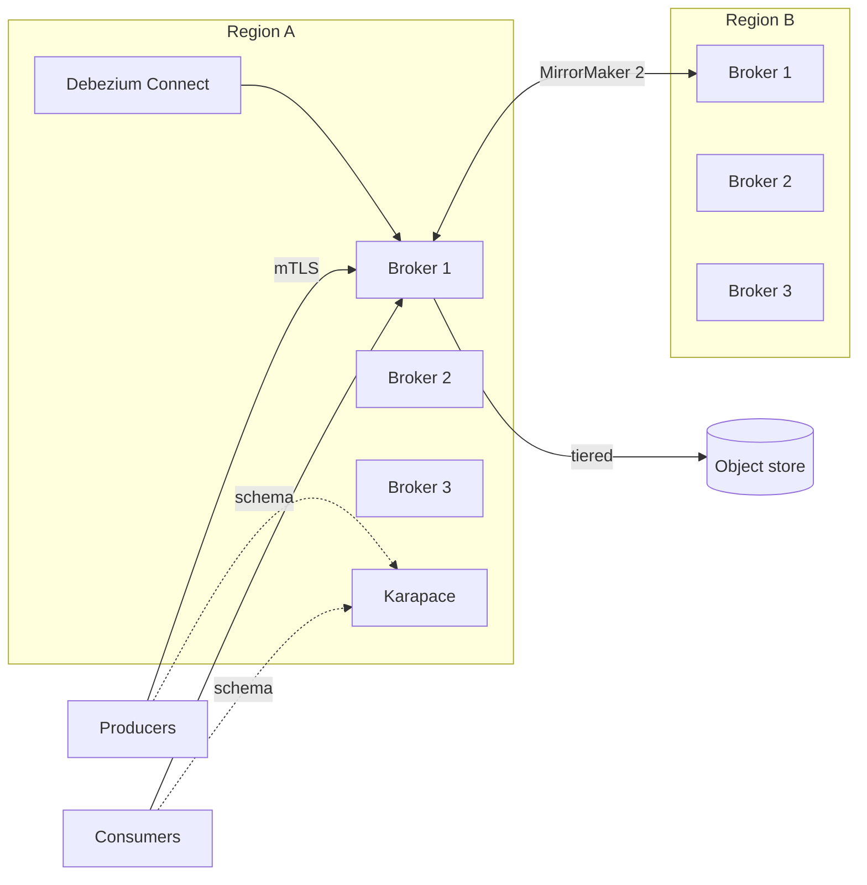

# 05 — Event Streaming (Apache Kafka)

> **Document purpose**: Define the **Kafka topology, topic catalog, schema registry strategy, consumer groups, retention policies, and operational playbook** that make HelixGitpx's event backbone reliable and replayable.

---

## 1. Why Kafka

Kafka is the **system of record for events**. Every meaningful change in HelixGitpx produces a Kafka event; every read model is a projection of those events. This gives:

- **Durability**: events persist even if all services restart.
- **Replayability**: rebuild any projection (Postgres read model, OpenSearch index, Qdrant vector store) from topic head.
- **Fan-out**: N consumers read the same event independently.
- **Back-pressure**: consumer lag is observable and scalable.
- **Time-travel**: "show me repo X as of 2026-04-01 09:00" is a deterministic read of events ≤ timestamp.
- **Cross-region replication**: MirrorMaker 2 for DR.

We chose Kafka over NATS JetStream and Redpanda for **ecosystem maturity** (Debezium, Karapace, Strimzi, ksqlDB) and **proven scale**. ADR-0002 records the decision.

---

## 2. Deployment

| Attribute | Value |
|---|---|
| **Distribution** | Apache Kafka 3.8+ (KRaft mode, no ZooKeeper) |
| **Operator** | Strimzi on Kubernetes |
| **Brokers** | 3 in single-region GA; 5 per region in multi-region |
| **Replication factor** | 3 (min.insync.replicas = 2) |
| **Rack awareness** | `broker.rack = <zone>` mapped to K8s topology zones |
| **Schema Registry** | **Karapace** (Apache 2.0) — chosen over Confluent Schema Registry for license |
| **CDC** | **Debezium** for Postgres → Kafka outbox |
| **Stream processing** | **Kafka Streams** (Go where possible) + ksqlDB for ad-hoc joins |
| **Cross-region** | **MirrorMaker 2** — selective topic replication |
| **Storage** | Tiered storage to S3/R2 (hot: 7 d local, cold: 1 y object) |
| **Compression** | `zstd` (better ratio than snappy, similar CPU) |
| **Auth** | mTLS via SPIFFE SVID; SASL/OAUTHBEARER fallback |
| **AuthZ** | ACLs enforced per-service principal |

### 2.1 Cluster Topology



---

## 3. Topic Naming Convention

```
helixgitpx.<bounded-context>.<entity>.<action>[.vN]
```

Examples:
- `helixgitpx.repo.ref.updated` (base version = v1 implicit)
- `helixgitpx.sync.job.completed`
- `helixgitpx.conflict.case.detected`
- `helixgitpx.ai.prompt.run.v2` (when a v2 schema is needed, new topic alongside)

Rules:
- Lowercase, dot-delimited.
- Version suffix only when a breaking schema change is necessary and backward-compatible evolution is not possible.
- "Events" is implicit — never `...events.updated`.
- One event type per topic, unless the events share the exact same key and small size where muxing is justified.

### 3.1 Partition Key Rules

| Event family | Key | Rationale |
|---|---|---|
| `repo.*` | `repo_id` | Preserves per-repo order |
| `sync.*` | `repo_id` | Serialises sync steps per repo |
| `conflict.*` | `repo_id` | Conflict resolver shards by repo |
| `org.*` | `org_id` | Admin ops are org-scoped |
| `ref.*` | `repo_id` | Ref ops grouped by repo |
| `ai.*` | `org_id` | Tenancy-scoped analytics |
| `audit.*` | `org_id` | Tenant-ordered audit |
| `policy.decisions` | `org_id` | Tenant grouping |
| `notify.*` | `channel_id` | Order per channel |
| `billing.*` | `org_id` | Per-tenant meter |

---

## 4. Topic Catalog

### 4.1 Core Domain Topics

| Topic | Partitions | Retention | Cleanup | Key | Schema Subject |
|---|---|---|---|---|---|
| `helixgitpx.repo.created` | 12 | 90 days | delete | `repo_id` | `repo.created-value` |
| `helixgitpx.repo.updated` | 12 | 90 days | delete | `repo_id` | |
| `helixgitpx.repo.archived` | 6 | 90 days | delete | `repo_id` | |
| `helixgitpx.repo.deleted` | 6 | 365 days | delete | `repo_id` | |
| **`helixgitpx.repo.events`** | **64** | **compact + 30 d delete** | **compact,delete** | **`repo_id`** | **`repo.event-value`** (union) |
| `helixgitpx.ref.updated` | 32 | 30 days | delete | `repo_id` | |
| `helixgitpx.ref.deleted` | 16 | 30 days | delete | `repo_id` | |
| `helixgitpx.ref.protected` | 6 | 90 days | delete | `repo_id` | |
| `helixgitpx.tag.created` | 16 | 90 days | delete | `repo_id` | |
| `helixgitpx.tag.deleted` | 8 | 90 days | delete | `repo_id` | |
| `helixgitpx.release.published` | 8 | 365 days | delete | `repo_id` | |
| `helixgitpx.pr.opened` | 16 | 90 days | delete | `repo_id` | |
| `helixgitpx.pr.updated` | 16 | 90 days | delete | `repo_id` | |
| `helixgitpx.pr.merged` | 16 | 365 days | delete | `repo_id` | |
| `helixgitpx.pr.closed` | 16 | 90 days | delete | `repo_id` | |
| `helixgitpx.review.submitted` | 16 | 90 days | delete | `repo_id` | |
| `helixgitpx.issue.opened` | 16 | 90 days | delete | `repo_id` | |
| `helixgitpx.issue.updated` | 16 | 90 days | delete | `repo_id` | |
| `helixgitpx.issue.closed` | 16 | 90 days | delete | `repo_id` | |
| `helixgitpx.comment.created` | 16 | 90 days | delete | `repo_id` | |
| `helixgitpx.org.created` | 3 | 365 days | delete | `org_id` | |
| `helixgitpx.org.updated` | 3 | 180 days | delete | `org_id` | |
| `helixgitpx.team.events` | 6 | 180 days | delete | `org_id` | union |
| `helixgitpx.membership.events` | 6 | 180 days | delete | `org_id` | union |
| `helixgitpx.auth.events` | 12 | 90 days | delete | `user_id` | union |

**Note**: The **compacted** `helixgitpx.repo.events` topic is the event-sourced store for the Repository aggregate. It uses a **union Avro schema** that covers all repo-related event types, keyed by `repo_id:sequence` for deterministic replay.

### 4.2 Sync & Conflict Topics

| Topic | Partitions | Retention | Cleanup | Key |
|---|---|---|---|---|
| `helixgitpx.sync.scheduled` | 16 | 7 days | delete | `repo_id` |
| `helixgitpx.sync.started` | 16 | 7 days | delete | `repo_id` |
| `helixgitpx.sync.step.completed` | 32 | 14 days | delete | `repo_id` |
| `helixgitpx.sync.completed` | 16 | 30 days | delete | `repo_id` |
| `helixgitpx.sync.failed` | 16 | 90 days | delete | `repo_id` |
| `helixgitpx.sync.dlq` | 8 | 90 days | delete | `repo_id` |
| `helixgitpx.conflict.detected` | 16 | 90 days | delete | `repo_id` |
| `helixgitpx.conflict.resolved` | 16 | 365 days | delete | `repo_id` |
| `helixgitpx.conflict.escalated` | 8 | 90 days | delete | `repo_id` |

### 4.3 Ingress Topics (raw + canonical)

| Topic | Partitions | Retention | Purpose |
|---|---|---|---|
| `helixgitpx.git.push.received` | 32 | 30 days | Local git-ingress produced; Sync Orchestrator consumes |
| `helixgitpx.git.pack.ingested` | 32 | 7 days | Pack persisted; triggers hooks |
| `helixgitpx.upstream.github.raw` | 16 | 7 days | Raw GitHub webhook (for debug/replay) |
| `helixgitpx.upstream.gitlab.raw` | 16 | 7 days | |
| `helixgitpx.upstream.gitee.raw` | 8 | 7 days | |
| `helixgitpx.upstream.gitflic.raw` | 8 | 7 days | |
| `helixgitpx.upstream.gitverse.raw` | 8 | 7 days | |
| `helixgitpx.upstream.bitbucket.raw` | 8 | 7 days | |
| `helixgitpx.upstream.codeberg.raw` | 8 | 7 days | |
| `helixgitpx.upstream.gitea.raw` | 8 | 7 days | |
| `helixgitpx.upstream.azure.raw` | 8 | 7 days | |
| `helixgitpx.upstream.generic.raw` | 8 | 7 days | |
| `helixgitpx.upstream.ref.received` | 32 | 30 days | Canonical (provider-normalised) |
| `helixgitpx.upstream.pr.received` | 16 | 30 days | Canonical |
| `helixgitpx.upstream.issue.received` | 16 | 30 days | Canonical |

### 4.4 AI / Notification / Audit / Billing

| Topic | Partitions | Retention | Cleanup |
|---|---|---|---|
| `helixgitpx.ai.prompt.run` | 8 | 30 days | delete |
| `helixgitpx.ai.suggestion.accepted` | 8 | 365 days | delete |
| `helixgitpx.ai.suggestion.rejected` | 8 | 365 days | delete |
| `helixgitpx.ai.fine_tune.scheduled` | 3 | 30 days | delete |
| `helixgitpx.ai.fine_tune.completed` | 3 | 365 days | delete |
| `helixgitpx.notify.requested` | 16 | 14 days | delete |
| `helixgitpx.notify.delivered` | 16 | 30 days | delete |
| `helixgitpx.notify.failed` | 8 | 90 days | delete |
| **`helixgitpx.audit.events`** | **64** | **7 years (tiered)** | delete |
| `helixgitpx.policy.decisions` | 32 | 90 days | delete |
| `helixgitpx.billing.usage` | 16 | 730 days | delete |
| `helixgitpx.billing.quota.exceeded` | 8 | 365 days | delete |
| `helixgitpx.dlq.global` | 16 | 90 days | delete |

### 4.5 Command Topics (for Sagas / Temporal fallback)

| Topic | Partitions | Retention |
|---|---|---|
| `helixgitpx.cmd.sync.request` | 16 | 7 days |
| `helixgitpx.cmd.conflict.resolve` | 8 | 7 days |
| `helixgitpx.cmd.upstream.connect` | 4 | 7 days |
| `helixgitpx.cmd.repo.migrate` | 4 | 7 days |

---

## 5. Schema Evolution

All topics use **Avro** with a Karapace-managed schema. Rules:

1. **Backward compatibility** is the default (`BACKWARD` subject strategy).
2. Fields are added with defaults; never removed (mark deprecated via `doc`).
3. Type changes (e.g. `int` → `long`) require a new topic (`.v2`).
4. **Canonical envelope** wraps every event:

```json
{
  "type": "record",
  "namespace": "io.helixgitpx.events",
  "name": "Envelope",
  "fields": [
    {"name":"event_id","type":{"type":"string","logicalType":"uuid"}},
    {"name":"event_type","type":"string"},
    {"name":"schema_version","type":"int","default":1},
    {"name":"occurred_at","type":{"type":"long","logicalType":"timestamp-micros"}},
    {"name":"producer","type":"string"},
    {"name":"trace_id","type":["null","string"],"default":null},
    {"name":"span_id","type":["null","string"],"default":null},
    {"name":"correlation_id","type":["null","string"],"default":null},
    {"name":"causation_id","type":["null","string"],"default":null},
    {"name":"tenant_id","type":["null","string"],"default":null},
    {"name":"payload","type":"bytes","doc":"Avro-encoded event body"}
  ]
}
```

5. Every service calls `karapace.getLatestSchema(subject)` on startup and caches with TTL; consumers use **Schema Registry deserialiser** (it downloads on demand and caches).

### 5.1 Sample Event Schemas

#### `ref.updated`

```json
{
  "type": "record",
  "namespace": "io.helixgitpx.events.ref",
  "name": "RefUpdated",
  "fields": [
    {"name":"repo_id","type":{"type":"string","logicalType":"uuid"}},
    {"name":"ref_name","type":"string"},
    {"name":"old_sha","type":["null","string"],"default":null},
    {"name":"new_sha","type":"string"},
    {"name":"is_force","type":"boolean","default":false},
    {"name":"origin","type":{"type":"enum","name":"Origin","symbols":["LOCAL","UPSTREAM","SYSTEM","AI"]}},
    {"name":"origin_detail","type":["null","string"],"default":null},
    {"name":"actor_id","type":["null","string"],"default":null},
    {"name":"signed","type":"boolean","default":false},
    {"name":"signer","type":["null","string"],"default":null}
  ]
}
```

#### `conflict.detected`

```json
{
  "type": "record",
  "namespace": "io.helixgitpx.events.conflict",
  "name": "ConflictDetected",
  "fields": [
    {"name":"case_id","type":{"type":"string","logicalType":"uuid"}},
    {"name":"repo_id","type":{"type":"string","logicalType":"uuid"}},
    {"name":"kind","type":{"type":"enum","name":"ConflictKind","symbols":[
       "REF_DIVERGENCE","METADATA_CONCURRENT","RENAME_COLLISION","PR_STATE","TAG_COLLISION","LFS_DIVERGENCE","OTHER"
    ]}},
    {"name":"subject","type":"string"},
    {"name":"upstream_id","type":["null","string"],"default":null},
    {"name":"left_sha","type":["null","string"],"default":null},
    {"name":"right_sha","type":["null","string"],"default":null},
    {"name":"base_sha","type":["null","string"],"default":null},
    {"name":"snapshot_ref","type":["null","string"],"default":null}
  ]
}
```

---

## 6. Producers & Consumers

### 6.1 Outbox Pattern (Postgres → Kafka)

We avoid dual writes by using **Debezium CDC** over a per-service **outbox table**:

```sql
CREATE TABLE <svc>.event_outbox (
  id UUID PRIMARY KEY,
  aggregate_kind TEXT NOT NULL,
  aggregate_id UUID NOT NULL,
  event_type TEXT NOT NULL,
  schema_version INT NOT NULL DEFAULT 1,
  payload BYTEA NOT NULL,            -- Avro-encoded
  headers JSONB NOT NULL DEFAULT '{}',
  occurred_at TIMESTAMPTZ NOT NULL DEFAULT now()
);
```

Flow:
1. Service writes domain row + outbox row in the same transaction.
2. Debezium tails logical replication → emits to the right Kafka topic.
3. After confirmed publish, Debezium marks the outbox row processed (via ACK topic).
4. Periodic cleaner deletes rows older than 24 h.

This gives **at-least-once** with transactional consistency. Consumers must be idempotent (keyed by `event_id`).

### 6.2 Consumer Groups

Consumer group naming: `<service>-<purpose>`.

| Consumer group | Topics | Concurrency |
|---|---|---|
| `sync-orchestrator-main` | `git.push.received`, `upstream.ref.received` | = partitions |
| `conflict-resolver-main` | `upstream.ref.received`, `cmd.conflict.resolve` | = partitions |
| `notifier-main` | all `*.events` that map to notifications | 16 |
| `audit-sink` | `#` (every topic) | 32 |
| `live-events-fanout` | all `*.events` | 32 (sticky) |
| `search-indexer-opensearch` | all `*.events` | 8 |
| `search-indexer-meili` | `repo.*`, `pr.*`, `issue.*`, `comment.*` | 8 |
| `vector-embedder` | `conflict.*`, `pr.*`, `issue.*` | 4 (GPU-bound) |
| `billing-meter` | `git.push.received`, `ai.prompt.run`, … | 4 |
| `analytics-exporter` | `#` | 4 |

### 6.3 Delivery Semantics

- **Producers**: `acks=all`, `enable.idempotence=true`, `max.in.flight.requests.per.connection=5`, `compression.type=zstd`.
- **Consumers**: manual commit after DB write succeeds; `isolation.level=read_committed`.
- **Exactly-once (EOS)**: enabled for Kafka-Streams topologies (transactional producer + consumer).
- **At-least-once** elsewhere with idempotent handlers.

### 6.4 Dead-Letter Queues

- Every consumer group has a matching `*.dlq` topic.
- Retry policy (Go wrapper): 3 retries with exponential backoff (1 s, 5 s, 30 s) → DLQ.
- DLQ inspector UI (Kafdrop / AKHQ) + CLI: `helixctl dlq replay --topic=… --from=offset --to=offset`.

---

## 7. Stream Processing Topologies

We use **Kafka Streams** (via Goka, Go port) and **ksqlDB** for ad-hoc.

### 7.1 Example — Conflict Detection Join

```
INPUT: helixgitpx.upstream.ref.received
INPUT: helixgitpx.ref.updated
OUTPUT: helixgitpx.conflict.detected

Logic:
  co-partition on repo_id
  windowed join (5 s) on (repo_id, ref_name)
  if (our.new_sha != their.new_sha AND NOT fast_forward) → emit conflict
```

Implemented in Go with Goka; tested against Testcontainers Kafka.

### 7.2 Example — Live Events Fan-Out

```
INPUT: helixgitpx.*  (all event topics)
STATE: Redis Streams per subscriber
Logic:
  For each event, look up subscribers in Redis set {repo:<id>, org:<id>, user:<id>}.
  Push event to each subscriber's Redis stream.
  Live-events-service pushes to client connections via gRPC stream / WebSocket.
```

---

## 8. Cross-Region Replication (MirrorMaker 2)

- Active-active: each region's local events mirror to the other with renamed topics (`regionA.helixgitpx.*` in region B, and vice versa).
- Application reads: local topics only.
- Conflict-resolver reads both local and mirrored — repo-keyed co-partitioning ensures correct ordering.
- MM2 uses **ACL replication** and **consumer offset sync** for seamless failover.
- RPO target: ≤ 30 s.

---

## 9. Backup & Replay

- **Hot storage**: 3-broker log segments (7 days).
- **Tiered storage**: S3/R2 using KIP-405 (Confluent tiered storage open-sourced as of 2024+).
- **Replay**: to rebuild a projection, reset the consumer-group offset to earliest or to a timestamp (`kafka-consumer-groups.sh --reset-offsets --to-datetime …`) and restart the consumer.
- **Backup**: nightly snapshot of topic metadata + ACLs + schemas to Git (`kafka-backup` + custom tool).

---

## 10. Observability

| Metric | Meaning |
|---|---|
| `helixgitpx_kafka_consumer_lag{group, topic, partition}` | Backlog |
| `helixgitpx_kafka_producer_errors_total{topic}` | Failed sends |
| `helixgitpx_kafka_dlq_events_total{topic}` | DLQ rate |
| `helixgitpx_kafka_schema_registry_cache_hit_ratio` | Client efficiency |
| `kafka_server_BrokerTopicMetrics_MessagesInPerSec` | Broker throughput |
| `kafka_log_Log_Size` | Disk usage |
| `kafka_controller_KafkaController_ActiveControllerCount` | Should be 1 |

Alerts (see [15-reference/alerts.md](../15-reference/alerts.md)):

- `KafkaConsumerLagHigh` (P2) — group lag > 10 000 for 5 min.
- `KafkaUnderReplicatedPartitions` (P1) — any > 0 for 5 min.
- `KafkaDLQFlood` (P2) — any DLQ > 100/min.
- `KafkaProducerErrorSpike` (P2).

---

## 11. Security

- **TLS 1.3** between all producers/consumers/brokers.
- **mTLS** client auth via SPIFFE SVIDs (2h rotation).
- **ACLs** per topic per principal (least privilege). Example: `sync-orchestrator` may READ `git.push.received` and WRITE `sync.*`, nothing else.
- **Kafka RBAC** via Strimzi `KafkaUser` resources (GitOps-managed).
- **Encrypt sensitive payload fields at rest**: not all events are equally sensitive; we use **tinkcrypto/tink-go** to envelope-encrypt PII fields (e.g. commit author email) inside the Avro blob, with per-tenant DEKs stored in Vault.

---

## 12. Testing Kafka Code

- **Unit**: mock producer/consumer via `twmb/franz-go/pkg/kmock` or `segmentio/kafka-go`'s test harness.
- **Integration**: **Testcontainers Kafka** — real broker, real Karapace.
- **Contract**: Pact/Schemathesis-style schema compatibility tests run on every PR.
- **Chaos**: **chaos-mesh** kills one broker during load tests; assert no data loss (replication + idempotent producers).
- **Replay**: every service must have a `replay` command that rebuilds its read model from a topic offset.

---

## 13. Runbooks

Pointers to [19-operations-runbook.md](../12-operations/19-operations-runbook.md):
- Add / remove broker.
- Rebalance under-replicated partitions.
- Schema deployment (breaking-change procedure).
- DLQ triage.
- Cross-region failover.
- Expand partitions on a growing topic.

---

*— End of Event Streaming —*
