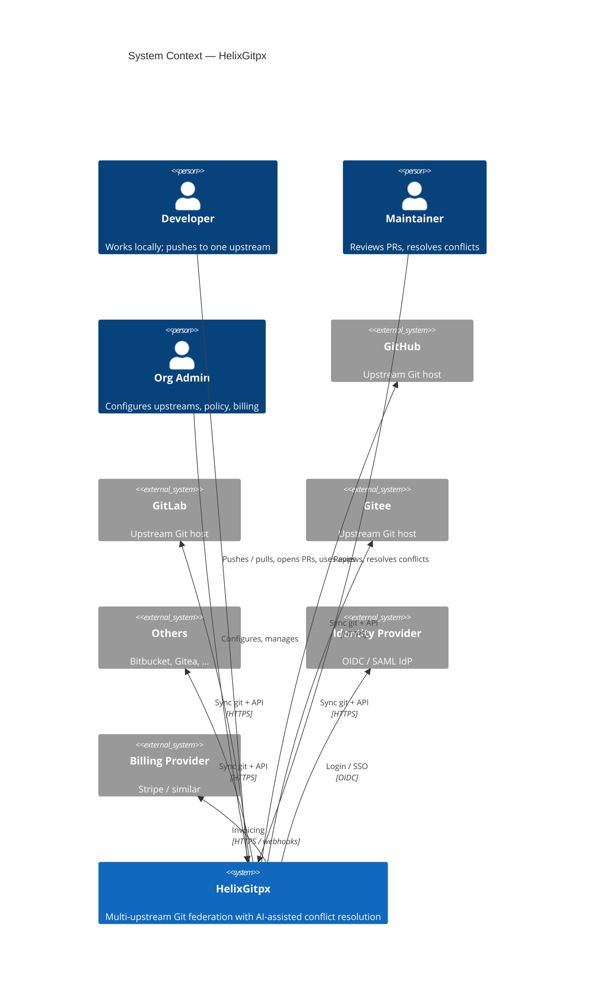
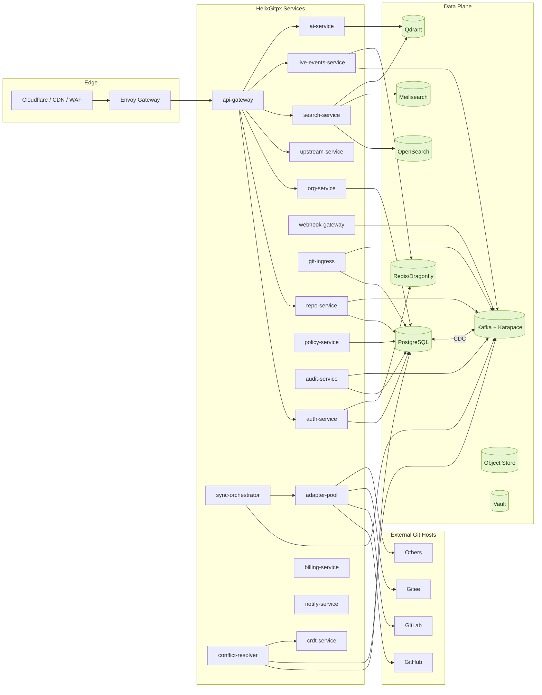
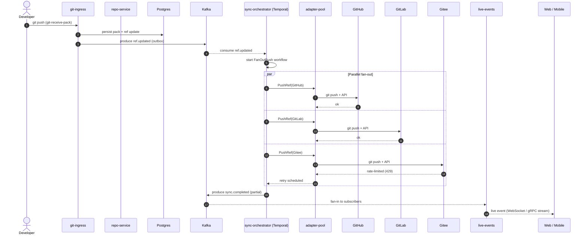
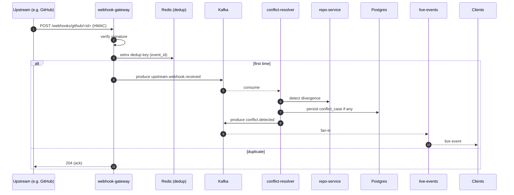
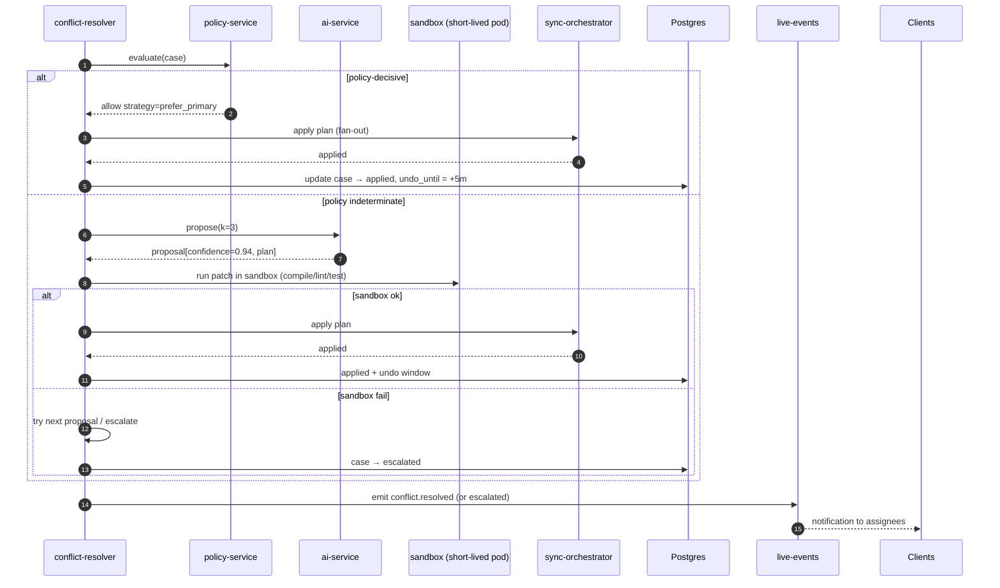
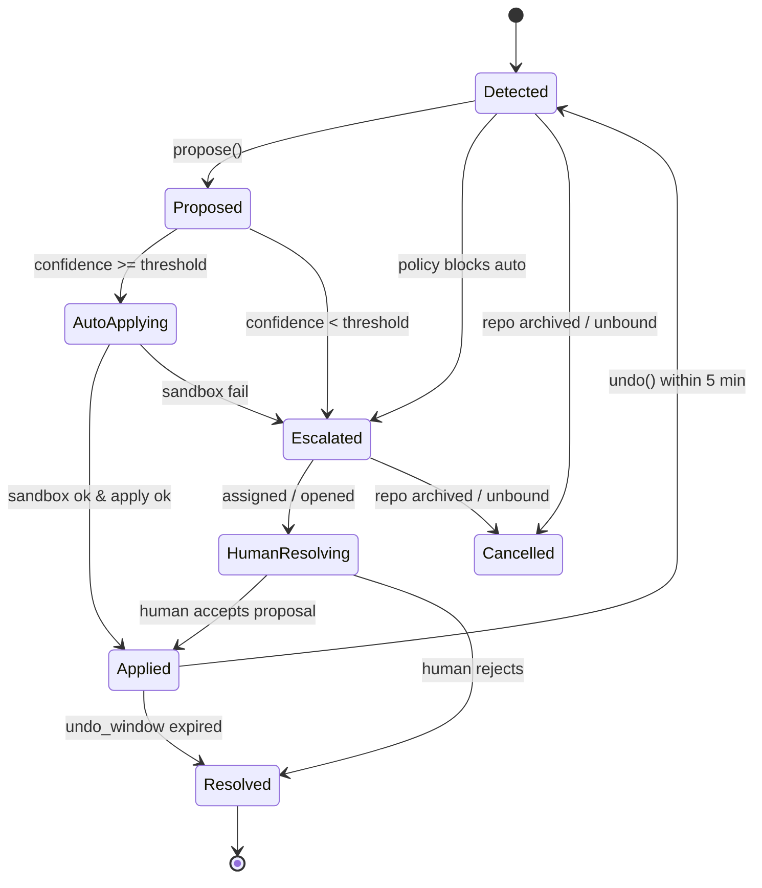
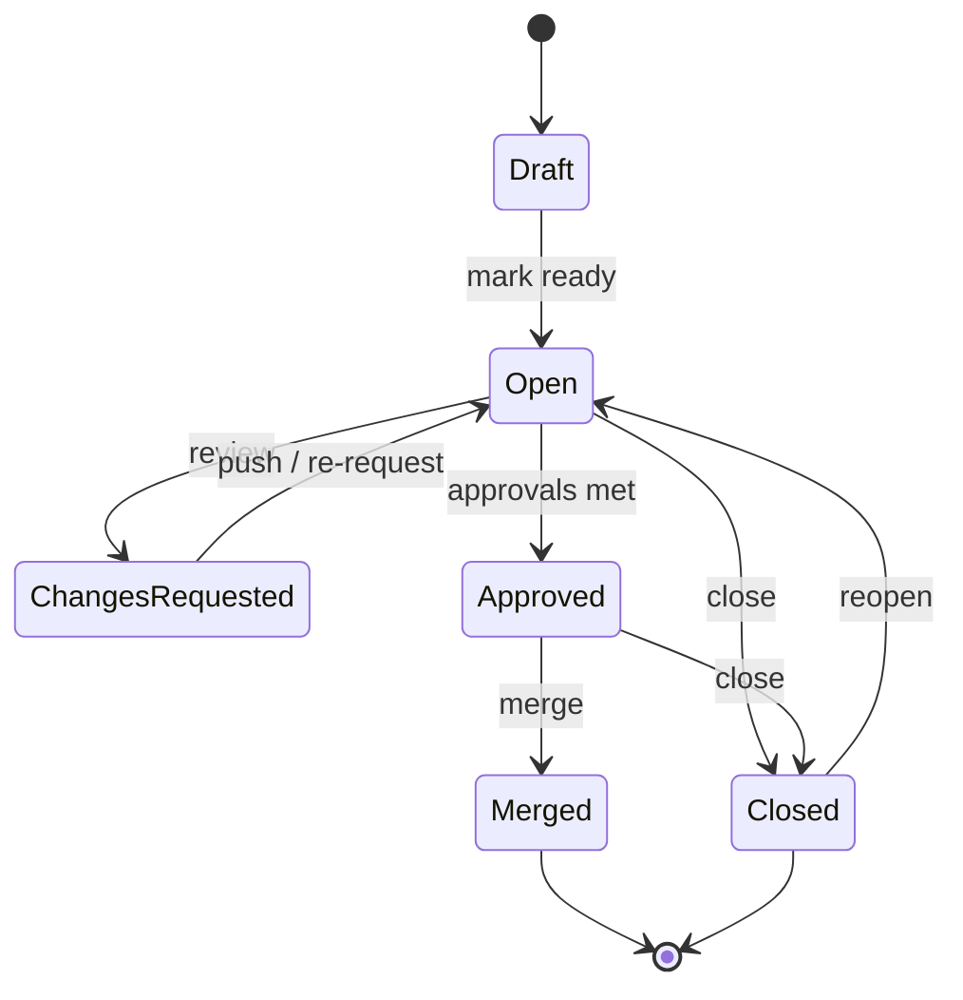
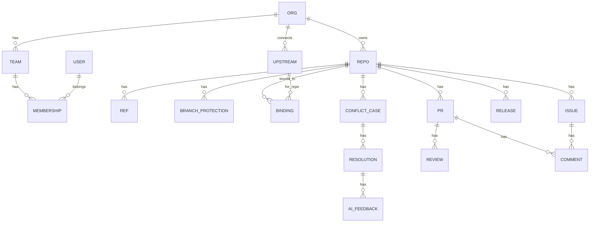
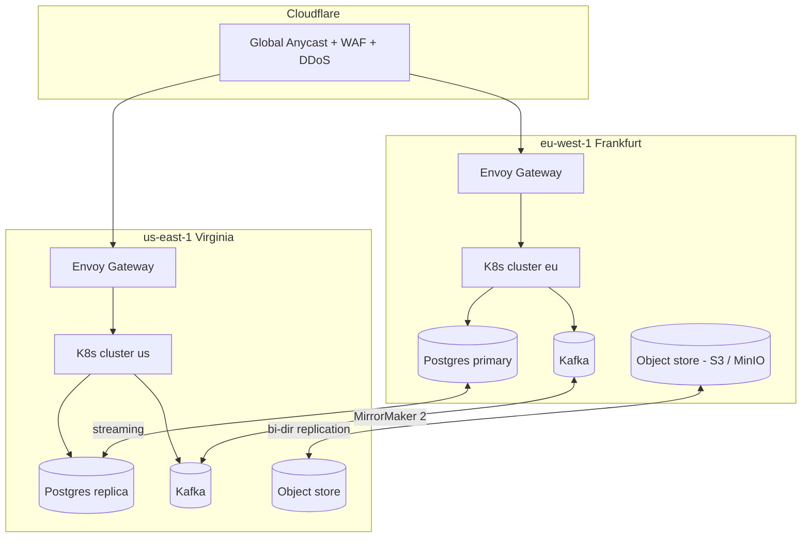
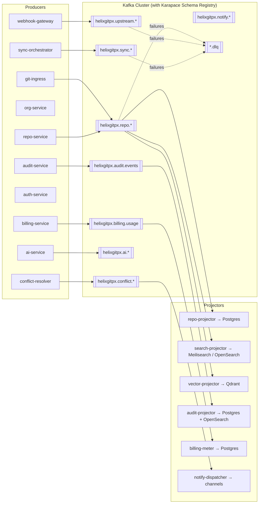

# Diagrams

This folder holds the canonical **diagram sources** for HelixGitpx. All diagrams are maintained as code (Mermaid / PlantUML / D2) so they can be version-controlled, diff-reviewed, and regenerated.

Rendering is automatic in GitHub and on the docs site. Local: `mmdc -i <src>.mmd -o <out>.svg` or `plantuml -tsvg <src>.puml`.

---

## Index

| File | Kind | Describes |
|---|---|---|
| `c4-context.mmd`         | C4 Level 1 | Whole system boundary & external actors |
| `c4-container.mmd`       | C4 Level 2 | Microservices and their shared dependencies |
| `sequence-push-fanout.mmd` | Sequence | A push replicates to every upstream |
| `sequence-webhook-ingest.mmd` | Sequence | An upstream webhook lands in Kafka |
| `sequence-conflict-resolve.mmd` | Sequence | Detection → proposal → apply |
| `sequence-login-oidc.mmd` | Sequence | Browser OIDC login flow |
| `state-conflict-case.mmd` | State | `Case` status transitions |
| `state-pr.mmd`           | State | Pull-request state machine |
| `er-core.mmd`            | ER | Core entities (org→repo→ref→upstream) |
| `deployment-regions.mmd` | Deployment | Multi-region topology |
| `data-flow-events.mmd`   | Data flow | Producers → Kafka → Projectors → Read models |

---

## c4-context.mmd



---

## c4-container.mmd



---

## sequence-push-fanout.mmd



---

## sequence-webhook-ingest.mmd



---

## sequence-conflict-resolve.mmd



---

## sequence-login-oidc.mmd

```mermaid
sequenceDiagram
    autonumber
    actor U as User
    participant W as Web App
    participant GW as api-gateway
    participant AUTH as auth-service
    participant IDP as OIDC IdP

    U->>W: click "Login"
    W->>AUTH: StartOIDCFlow(provider)
    AUTH-->>W: authorization_url + state + code_challenge
    W-->>U: redirect to IdP
    U->>IDP: authenticate
    IDP-->>W: redirect with code
    W->>AUTH: Login(oidc{code, code_verifier})
    AUTH->>IDP: token exchange + userinfo
    IDP-->>AUTH: id_token, access_token, claims
    AUTH->>AUTH: upsert user; issue JWT access + rotating refresh
    AUTH-->>W: TokenResponse + User
    W-->>U: logged in
```

---

## state-conflict-case.mmd



---

## state-pr.mmd



---

## er-core.mmd



---

## deployment-regions.mmd



---

## data-flow-events.mmd



---

## Contribution Notes

- Keep diagram complexity low — split into multiple files rather than one massive diagram.
- Names in diagrams must match the glossary.
- When architecture changes, update diagrams in the same PR as code.
- Review PRs: if a diagram is impacted, reviewer must confirm freshness.
